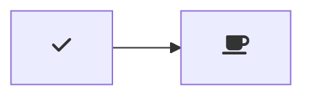
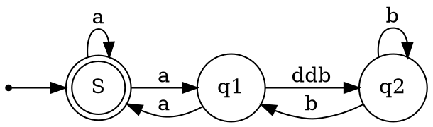

---
puppeteer:
    pdf:
        format: A4
        displayHeaderFooter: true
        margin:
            top: 1cm
            right: 1cm
            bottom: 1cm
            left: 1cm
    image:
        quality: 90
        fullPage: true

---

        "markdown.styles": [
    "https://maxcdn.bootstrapcdn.com/bootstrap/4.0.0/css/bootstrap.min.css"
]
Sample Exporting instructions

[See Here ~~later](http://mixu.net/markdown-styles/)~~


# Markdown Reference
/* Create two columns/boxes that floats next to each other */
<style>
nav {
  float: left;
  width: 30%;
  
  background: #ccc;
  padding: 20px;
}

/* Style the list inside the menu */
nav ul {
  list-style-type: none;
  padding: 0;
}
</style>


<section>
  <nav>
    <ul>
      <li><a href="#">London</a></li>
      <li><a href="#">Paris</a></li>
      <li><a href="#">Tokyo</a></li>
    </ul>
  </nav>

<style>
    .floating-menu {
    font-family: sans-serif;
    background: yellowgreen;
    padding: 5px;;
    width: 130px;
    z-index: 100;
    position: fixed;
  }
  .floating-menu a, 
  .floating-menu h3 {
    font-size: 0.9em;
    display: block;
    margin: 0 0.5em;
    color: white;
  }
  </style>

## Working Font List

"CaskaydiaCove Nerd Font",
"Pragmata Pro",
"CamingoCode",
"BPScript",
"Proxima Nova",
 "'DejaVuSansMono NF'",
## Summary of symbols

** New Keybindings I added

- `*x*` italics   [[Ctrl]]&[[I]]  *example*
- `**x**` or `__x__`  bold [[Ctrl]]&[[B]]  **example** __example__
- `_underline` _example_ 
- `~~strikethrough~~` [[Ctrl]]&[[S]]  ~~example~~
- `==mark==`  ==example==
- `:emoji` 
- `[LinkText](111Link)`
- `[InnerLinkText](#Inner-Link-Text)`
- ``
  - ``
      - can make it cling to the right
      -- 
- `*[Abbr]: Abbreviations`   *[HTML]: Hyper Text Markup Language
- `!!!Admonition` [^jebbs.markdown-extended] 
    - see below
- `~Sub~script`   ~subscript~
- `^super^script`  [^jebbs.markdown-extended] ^superscript^  
- `[ ]` `[x]`  checkbox  [^jebbs.markdown-extended]  - must be at the front of the line
    - [x] example
    - [ ] example
- `[[Ctrl+Esc]]` Keyboard Keys  [^jebbs.markdown-extended]  [[Ctrl]] + [[Alt]]
  -  `---` - 3 or more - [[-]] hyphens
  ---
  - `___` 3 or more [[_]] underscores
  ____
- Title Add a line underneath [[=]]
-  seems to make sections

  -ex
  =

  --ex2
  ==
  
  ---ex3
  ===
- blockquote
    >- 1
    >- 2
    >- 3
    >- 4
    >- 5

----
  <blockquote>

  - 1
  - 2
  - 3
  - 4
  - 5
  - 6
  </blockquote>
-code block
  ` ``` `
- or 3 tabs
- or `~~~`

~~~
test
~~~


- `[^footnote]:`  [^jebbs.markdown-extended]  [^example]

- `[^referenceToFootnote]`  [^jebbs.markdown-extended]

- `{style="color:red"}` Attributes [^jebbs.markdown-extended]
- `<!-- @import "your_file" -->` [^MarkdownPreviewEnhanced]
- `@import "your_file"`[^MarkdownPreviewEnhanced]
another ext:
- `:(file.md)` include file in place
- - conflics with emoji
- `!!!include(file.md)!!!`
- - conflicts with Admonitions
- Divider Line 


---
[^example]: test
___
<iframe  allowfullscreen="true" width="100%" style="border:1px solid green;background:blue";  ><p>

</iframe>


## HTML Examples

### Image with click maps

<html>
<body>
<p>Click on the computer, the phone, or the cup of coffee to go to a new page and read more about the topic:</p>


<map name="workmap">
  <area shape="rect" coords="34,44,270,350" alt="Computer" href="computer.htm">
  <area shape="rect" coords="290,172,333,250" alt="Phone" href="phone.htm">
  <area shape="circle" coords="337,300,44" alt="Cup of coffee" href="coffee.htm">
</map>

</body>
</html>


### svg


<svg width="100" height="100">
  <circle cx="50" cy="50" r="40" stroke="green" stroke-width="4" fill="yellow" />
</svg>


### Span (simpler than style)
> <p>My mother has <span style="color:blue">blue</span> eyes.</p>

### details 

<details>
  <summary>Epcot Center</summary>
  <p>Epcot is a theme park at Walt Disney World Resort featuring exciting attractions, international pavilions, award-winning fireworks and seasonal special events.</p>
</details>

### text area

<label for="w3review">Review of W3Schools:</label>

<textarea id="w3review" name="w3review" rows="4" cols="50">
At w3schools.com you will learn how to make a website. They offer free tutorials in all web development technologies.
</textarea>

<label for="w3revie2">Review of W3Schools:</label>

<textarea id="w3revie2" name="w3review" rows="4" cols="50" style="color:blue; background:gray" draggable=true>
At w3schools.com you will learn how to make a website. They offer free tutorials in all web development technologies.
</textarea>

### code 
<code> var.property = new Object(param) </code>

`var.property = new Object(param)`

### Samp  - monopspace output
<samp> Computer Output  Results </samp>


### Options

<label for="cars">Choose a car:</label>

<select id="cars">
  <option value="volvo">Volvo</option>
  <option value="saab">Saab</option>
  <option value="opel">Opel</option>
  <option value="audi">Audi</option>
</select>


<figure>
  
  <figcaption style=>Fig.1 - Trulli, Puglia, Italy.</figcaption>
</figure>
----
----


### Styles

[Styles Ref](https://www.w3schools.com/html/html_styles.asp)
`<tag style="property:value;">`

Use the `style` attribute for styling HTML elements
Use `background-color` for background color
Use `color` for text colors
Use `font-family` for text fonts
Use `font-size` for text sizes
Use `text-align` for text alignment

`<b>` - Bold text
`<strong> `- Important text
`<i> `- Italic text
`<em>` - Emphasized text
`<mark>`  - Marked text
`<small>` - Smaller text
`<del>` - Deleted text
`<ins>` - Inserted text
`<sub>` - Subscript text
`<sup>` - Superscript text


[140 standard color names](https://www.w3schools.com/colors/colors_names.asp)

### CSS Styles

#### Internal 
seems like you can add it anywhere.

<!-- <html> -->
<!-- <head> -->
<style>
/* body {background-color: powderblue;} */
h1   {color: blue;}
h2    {color: red;}
h3  {color:green;background-color:#FFFA}
</style>
<!-- </head> -->


      <html>
      <head>
      <style>
      /* body {background-color: powderblue;} */
      h1   {color: blue;}
      h2    {color: red;}
      </style>
      </head>


#### External

    <html>
    <head>
      <link rel="stylesheet" href="styles.css">
    </head>
    <body>


CSS can be added to HTML documents in 3 ways:

Inline - by using the style attribute inside HTML elements
Internal - by using a <style> element in the <head> section
External - by using a <link> element to link to an external CSS file


* Create two columns/boxes that floats next to each other */


## A floating box
<style>
nav {
  float: right;
  width: 30%;
  background: #ccc;
  padding: 20px;
}
/* Style the list inside the menu */
nav ul {
  list-style-type: none;
  padding: 0;
}
</style>

<section>
  <nav>
    <ul>
    Another List
      <li><a href="">London</a></li>
      <li><a href="#">Paris</a></li>
      <li><a href="#">Tokyo</a></li>
    </ul>

  </nav>
</section>


<section>
<nav>

```html
    <section>
      <nav>
        <ul>
        Another List
          <li><a href="">London</a></li>
          <li><a href="#">Paris</a></li>
          <li><a href="#">Tokyo</a></li>
        </ul>
      </nav>
    </section>
```
  </nav>
</section>

### Floating Menu next to it

by default it appears to the right
```html

<!-- code block -->

<style>
    .floating-menu {
    font-family: sans-serif;
    background: purple;
   border: 8px solid powderblue;
    padding: 5px;
    font-size:7pt;
    width: 130px;
    z-index: 100;
    position: fixed;
  }
  .floating-menu a, 
  .floating-menu h3 {
    font-size: 0.9em;
    display: block;
    margin: 0 0.5em;
    color: white;
    float:right
  }
  </style>
```

<style>
    .floating-menu {
    font-family: sans-serif;
    background: #F906;
    border: 2px solid powderblue;
    padding: 5px;;
    font-size:7pt;
    width: 130px;
    z-index: 100;
    position: fixed;
   right: 6vw;
   top: 20vh;
  }
  .floating-menu a, 
  .floating-menu h3 {
    font-size: 0.9em;
    display: block;
    margin: 0 0.5em;
    color: white;
    
  }
  </style>


<nav class="floating-menu">
    <h3>Floating Menu</h3>
    <!-- vscode-markdown-toc -->
    <a href="WorkingFontList"></a>
    <a href="Summaryofsymbols"></a>
    1
    
    2
    
    3
    
    4
    
    54

  </nav>
---
Microsoft Docs uses another form for Admonitions:

These (and others) Added by jebbs.markdown extended.


onCommand:markdownExtended.toggleBold
onCommand:markdownExtended.toggleCodeBlock
onCommand:markdownExtended.toggleCodeInline
onCommand:markdownExtended.toggleItalics
onCommand:markdownExtended.toggleSubscript
onCommand:markdownExtended.toggleOList
onCommand:markdownExtended.toggleStrikethrough
onCommand:markdownExtended.toggleUList
onCommand:markdownExtended.toggleUnderLine
onCommand:markdownExtended.toggleMark
onCommand:markdownExtended.toggleSuperscript
onCommand:markdownExtended.toggleBlockQuote

`[[TOC]]`

## Microsoft Docs

Microsoft Docs - supports the following insert types.

- ==Preview (Alt+DP)== - Preview the active topic in a side-by-side window using the Docs Preview extension, if it is installed.
- ==Search Results Preview== - Approximates how your article will look when returned in Google search results.
- ==Bold (Alt+DB)== - Format text bold.
- ==Italic (Alt+DI)== - Format text italic.
- ==Code== - If one line or less is selected, formats text as inline code.

  - If multiple lines are selected, formats them as a fenced code block, and prompts you to select a programming language supported by Docs.
- ==Alert== - Insert a Note, Important, Warning, or Tip.

- Select Alert from the menu, then select the alert type. If you have previously selected text, it will be surrounded with the selected alert syntax. If no text is selected, a new alert will be added with placeholder text.
- ==Numbered list== - Insert a new numbered list.

  - If multiple lines are selected, each will be a list item. To create a nested numbered list, tab from within the parent list.
- ==Bulleted list== - Insert a new bulleted list.
- ==Table== - Insert a Markdown table structure.

  - After you select the table command, specify the number of columns and rows in the format columns:rows, such as 3:4. Note that the maximum number of columns you can specify via this extension is 5, which is the recommended maximum for readability on docs.microsoft.com.
- ==Columns== - Insert a column-based layout structure, or add a column to an existing structure. Optionally add the span attribute to merge two to four columns together.
- ==Link== - Coose from the following options:
  - Link to file in repo: Inserts a link to a file in the current repo.
  - Link to web page: Inserts a link to a web page URI.
  - Link to heading: Inserts a link to a heading in the current file or another file in the current repo.
  - Link to XRef: Links to a .NET or UWP API reference article. First, you search for the API, such as System.String.Length. Then you choose a display property: none (just the API name will be displayed as link text, such as "Length"); nameWithType (the API name and its immediate parent will be displayed, such as "String.Length"); fullName (the full API name will be displayed, such as "System.String.Length"). To provide custom link text, select the text first, then use this function to insert the XREF link.
  - Generate a Link Report: runs the LinkCheckMD extension to find broken links in the current article.
- ==Non-localizable text== - Within the Markdown body of a file, format text as non-localizable (:::no-loc text="string":::). Within the YAML header of a Markdown file, add a metadata array to be populated with strings that should be non-localizable throughout the file ( no-loc: []).
- ==Image== - Insert a standard image, complex image, or icon. For standard and complex images, alternate text is required for accessibility. Either select the alt text before calling the Image command, or add it before you select the image source file. For complex images, type a detailed description between the :::image::: and :::image-end::: tags. You can optionally add the loc-scope attribute to standard and complex images to indicate that the scope of localization is different for the image than for the article or module that contains it. Icons should not have alt text and are not localized, so only the image source file should be specified.
- ==Include== - Find a file in the repo to embed in the current file.
- ==Snippet== - Find a code snippet in the repo to embed in the current file.
- ==Cleanup== - Run one of the Docs Cleanup scripts (see Cleanup scripts below).
- ==Video== - Add an embedded video.
- ==Template== - Insert a Markdown authoring template, if the Docs Article Templates extension is installed.


!!!note 
      !!!summary  summary  abstract  tldr
      !!!info todo info
      !!!tip tip hint 
      !!!success success check  done 
      !!!question question help faq
      !!!warning warning  caution
      !!!attention 
      !!!failure  failure fail missing  error
      !!!danger 
      !!!bug 
      !!!example example snippet
      !!!quote quote  cite
      !!!

## Text Boxes 

> Assignment expressions allow you to assign and return a value in the same expression. For example, if you want to assign to a variable and print its value, then you typically do something like [[1]] while in  Python 3.8, you’re allowed to combine these two statements into one, using the walrus operator: [[2]]
>> Some more
>>> And even More?
>>>> More still?
>>>>> More?
>>>>>> More
>>>>>>> Still going
>>>>>>>> Endless Inner
>>>>>>>>> Boxes


## Add Image


Syntax:

``

      moosbr/vscode-markdown-imsize/raw/master/sample-image.png =200x100)

is interpreted as:

      <p></p>

using `imgSize` extension, and `Markdown Preview Enhanced`

`imgsize` can take the following format:

_**width x height**_

      "...e/raw/master/sample-image.png =200x100)"

 *  Note: Width or height can be omitted. In this case the aspect ratio is honored during resize.*

    -  image.png =200x)  **no height**
    -  image.png =x100)  **no width**


_**percentage**_

      "...ode-markdown-imsize/raw/master/sample-image.png =50%x)"


## Text Formatting

 ### Bold `**`

 ### Italic `*`

 ### Superscript
 Superscript surround with `^` eg.  23^2^ * 2^1/2^
   - does not work in code blocks

### Diver Line

-----

### Subscript

Subscript surround with `~` eg.  H~2~O

Strike out surround with `~~` eg. ~~strikeout~~ 


Mark = `==`text`==` to make a ==highlight effect==

To make a text subbox - prefix each line with `>`

> this is a text
> box that makes 
> a quoted
>**effect**

>  Sometimes it seems only 1 `>` is needed but its inconsistent as far as I can tell.
  Sometimes it seems only 1 `>` is needed but its inconsistent as far as I can tell.
  Sometimes it seems only 1 `>` is needed but its inconsistent as far as I can tell.
  Sometimes it seems only 1 `>` is needed but its inconsistent as far as I can tell.
  
  to do this, each line needs to be tabbed over one, and the first line then prefixed with `>`

```
>  Sometimes it seems only 1 `>` is needed but its inconsistent as far as I can tell.
  Sometimes it seems only 1 `>` is needed but its inconsistent as far as I can tell.
```

A comment in markdown uses `<!--`this `-->` The text surrounded thus is not visible at all in the rendering.


## Markdown Include:  [^jebbs.markdown-extended]


:(file.md)
!!!include(file.md)!!!

## Exporter [^jebbs.markdown-extended]

Find in command palette, or right click on an editor / workspace folder, and execute:

            Markdown: Export to File
            Markdown: Export Markdown to File

The export files are organized in out directory in the root of workspace folder by default.

### Export Configurations

You can configure exporting for multiple documents with user settings.

Further, you can add per-file settings inside markdown to override user settings, it has the highest priority:

```yaml
---
puppeteer:
    pdf:
        format: A4
        displayHeaderFooter: true
        margin:
            top: 1cm
            right: 1cm
            bottom: 1cm
            left: 1cm
    image:
        quality: 90
        fullPage: true
---
contents goes here...
```


See all available settings for [puppeteer.pdf](https://github.com/GoogleChrome/puppeteer/blob/v1.4.0/docs/api.md#pagepdfoptions)

, and [puppeteer.image](https://github.com/GoogleChrome/puppeteer/blob/v1.4.0/docs/api.md#pagescreenshotoptions)


### Exporting as HTML [^jebbs.markdown-extended]

Export to HTML
Copy HTML To Clipboard
Export to HTML with styles


Export & Copy
command


## Table Editing

Editing Helpers and Keys
Inspired by joshbax.mdhelper, but totally new implements.

Command	Keyboard Shortcut
Format: Toggle Bold	Ctrl+B
Format: Toggle Italics	Ctrl+I
Format: Toggle Underline	Ctrl+U
Format: Toggle Mark	Ctrl+M
Format: Toggle Strikethrough	Alt+S
Format: Toggle Code Inline	Alt+`
Format: Toggle Code Block	Alt+Shift+`
Format: Toggle Block Quote	Ctrl+Shift+Q
Format: Toggle Superscript	Ctrl+Shift+U
Format: Toggle Subscript	Ctrl+Shift+L
Format: Toggle Unordered List	Ctrl+L, Ctrl+U
Format: Toggle Ordered List	Ctrl+L, Ctrl+O
Table: Paste as Table	Ctrl+Shift+T, Ctrl+Shift+P
Table: Format Table	Ctrl+Shift+T, Ctrl+Shift+F
Table: Add Columns to Left	Ctrl+Shift+T, Ctrl+Shift+L
Table: Add Columns to Right	Ctrl+Shift+T, Ctrl+Shift+R
Table: Add Rows Above	Ctrl+Shift+T, Ctrl+Shift+A
Table: Add Row Below	Ctrl+Shift+T, Ctrl+Shift+B
Table: Move Columns Left	Ctrl+Shift+T Ctrl+Shift+Left
Table: Move Columns Right	Ctrl+Shift+T Ctrl+Shift+Right
Table: Delete Rows	Ctrl+Shift+D, Ctrl+Shift+R
Table: Delete Columns	Ctrl+Shift+D, Ctrl+Shift+C
Looking for Move Rows Up / Down? You can use vscode built-in Move Line Up / Down, shortcuts are alt+↑ and alt+↓

Table Editing
tableEdit

moveCols

Move columns key bindings has been changed to ctrl+shift+t ctrl+shift+left/right, due to #57, #68

Paste as Markdown Table
Copy a table from Excel, Web and other applications which support the format of Comma-Separated Values (CSV), then run the command Paste as Markdown Table, you will get the markdown table.


pasteTable option


Move columns key bindings has been changed to [[ctrl]]+[[shift]]+[[t]] [[ctrl]]+[[shift]]+[[left/right]], due to #57, #68

Paste as Markdown Table
Copy a table from Excel, Web and other applications which support the format of Comma-Separated Values (CSV), then run the command Paste as Markdown Table, you will get the markdown table.


## Footnotes: [^jebbs.markdown-extended]


markdown-it-footnote


Reference with `[^x]` where x is any flag to id it.  Number or text.

Call it up with `[^x]:` the footnote.  Note the colon.  [^1]

[^1]: example.

Here is a footnote reference,[^1] and another.[^longnote]

[^1]: Here is the footnote.
[^longnote]: Here's one with multiple blocks.
Here is a footnote reference,[1] and another.[2]

## markdown-it-table-of-contents  [^jebbs.markdown-extended]

`[[TOC]]`


## markdown-it-abbr  [^jebbs.markdown-extended]

*[HTML]: Hyper Text Markup Language
*[W3C]:  World Wide Web Consortium
The HTML specification
is maintained by the W3C.
The HTML specification is maintained by the W3C.

## markdown-it-deflist  [^jebbs.markdown-extended]

Apple
:   Pomaceous fruit of plants of the genus Malus in the family Rosaceae.
Apple
Pomaceous fruit of plants of the genus Malus in the family Rosaceae.


## markdown-it-sup   [^jebbs.markdown-extended]

29th
29^th^

## markdown-it-sub  [^jebbs.markdown-extended]

 H2O
 H~2~O

## markdown-it-checkbox  [^jebbs.markdown-extended]

[ ] unchecked
[x] checked


## markdown-it-attrs [^jebbs.markdown-extended]

item **bold red**{style="color:red"}
item bold red

## markdown-it-kbd [^jebbs.markdown-extended]

[[Ctrl+Esc]]

`[[Ctrl+Esc]]`

Ctrl+Esc

## markdown-it-underline [^jebbs.markdown-extended]

_underline_
underline

## markdown-it-container [^jme]

::::: container
:::: row
::: col-xs-6 alert alert-success
success text
:::

::: col-xs-6 alert alert-warning
warning text
:::
::::
:::::

container-demo.png

## Markdown mark

[Link to site](https://www.npmjs.com/package/markdown-it-mark)


~~!!!fail doesnt seem to work.~~

Works, may be incompatible with white background or non-inclusive css files.

Seems included in [^jme] 

==mark==

var md = require'markdown-it')()
            .use(require('markdown-it-mark'));
 
md.render('==marked==')


## Multi-MD table  

!!!fail doesnt seem to work.

[Link to Site](https://www.npmjs.com/package/markdown-it-multimd-table)


`|   Markdown   | Rendered HTML |
|--------------|---------------|
|    *Italic*  | *Italic*      | \
|              |               |
|    - Item 1  | - Item 1      | \
|    - Item 2  | - Item 2      |
`|    ```python | ```python       \`
`|    .1 + .2   | .1 + .2         \`
`|    ```       | ```           |`


Stage | Direct Products | ATP Yields
----: | --------------: | ---------:
Glycolysis | 2 ATP ||
^^ | 2 NADH | 3--5 ATP |
Pyruvaye oxidation | 2 NADH | 5 ATP |
Citric acid cycle | 2 ATP ||
^^ | 6 NADH | 15 ATP |
^^ | 2 FADH2 | 3 ATP |
**30--32** ATP |||
[Net ATP yields per hexose]


## Disable Plugings in jebbs Markdown Extended

Disable Plugins
To disable integrated plugins, put their names separated with ,:

`"markdownExtended.disabledPlugins": "underline, toc"`

## Markdown Styles [^jme]

[Markdown Custom Styles](https://code.visualstudio.com/Docs/languages/markdown#_using-your-own-css)


(Rendered with style bootstrap, to see the same result, you need the follow config)

    "https://maxcdn.bootstrapcdn.com/bootstrap/4.0.0/css/bootstrap.min.css"

    "https://use.fontawesome.com/releases/v5.7.1/css/all.css"


## Markdown Attributes [^jme]

markdown-it-attrs
item **bold red**{style="color:red"}

`{style="color:red"}`


### Attributes

[markdown-it-attrs](https://www.npmjs.com/package/markdown-it-attrs)

item **bold red**{style="color:red"}
        
        item **bold red**{style="color:red"}

!!!tldr tldr after a `bold` symbol e.g. `**`...`**`, follow in braces a style `{style=` `}` with the command quoted `"color:red"`

Its unclear what commands are available.

It looks like all the [HTML Color Names](https://www.w3schools.com/colors/colors_names.asp) are available:

Also, [CSS Syntax](https://www.w3schools.com/css/css_syntax.asp) May also be relevant

- unstyled **style sample**{style="color:red"}
- unstyled **style sample**{style="color:black"}
- unstyled **style sample**{style="color:green"}
- unstyled **style sample**{style="color:cyan"}
- unstyled **style sample**{style="color:teal"}
- unstyled **style sample**{style="color:CornflowerBlue"} - so any of the 140 HTML color names can be used...
- unstyled **style sample**{.style-me} -sample from the site (first link) has no obvious effect.
- unstyled **style sample**{data-toggle=modal}
- unstyled **style sample**{style="color:green"}
- unstyled **style sample**{..green}
- `$ npm install --save markdown-it-attrs`{style="color:cyan"}
- _title_{style="color:cyan"}
- title{style="color:purple"} - so it doesnt need a delimiter if its on its own line, as below eg it ends with the style
- title{style="color:purple"} 
- unstyled *style sample*{style="color:red"} - so it still renders the bold and italics normally
- unstyled **styled sample2**{style="font-family:fantasy";color:CornflowerBlue}
- unstyled styled sample3c{style="font-style:italic; font-size:1.5em";color:CornflowerBlue}
- unstyled styled sample3c{style="font-style:bold; font-size:1.5em";color:CornflowerBlue}
- unstyled `styled sample4`{style="font-style:italic; font-size:12vw; color:purple; font-weight:bold; font-variant:small-caps"}

styled sample{style="text-align:center"}

1. test{style="text-align:center"}

2. {style="text-align:center"} works if on a line by itself

3. Test2{..h1}

4. Another test{style="border: 5px solid red"}

5. Another test{style="border: dotted blue"}

6. Another test{style="border: ridge blue"}

7. Another test{style="border: 10px inset blue"}


8. Another test{style="border: 10px outset blue"}

9. Another test{style="border: 10px ridge blue"}

10. Another test{style="border: 10px groove blue ; margin: 0px 10px"}

11. Another test{style="border: outset purple"}

12. Another test{style="border: ridge; border-color : green;"}

13. test{style="background: -webkit-linear-gradient(60deg, #FFFFFF, #AAAAAA); border: inset; margin: 20px }


14. Another test{style="border: dotted blue; border-width: thin medium thick 10px;"}


15. Another test{style="border: dotted; border-color: blue green red orange; border-width: thin medium 5px 10px;"}


16. Another test{style="border: double"}

17. Another Test {style="color: red;  text-align: center;"}

18. Another Test {style="color: red;  text-align: center; margin:auto; border: medium inset green; width: 20vw; background: linear-gradient(to right, #f46b45,#eea849); height:3vw; padding-top:20px;font-size:150%; width-min:100px"}


19. test9{style="<i class="material-icons">cloud</i>"}

20. tes  {style="color: red;  text-align: center; font-weight:100"}


21.. Text Test {style="font-family:'Times New Roman', Times, serif;"}


22. XML Tools {style="<i class="material-icons">cloud</i>"}


 ==**Digits**=={style="background: -webkit-linear-gradient(60deg, mediumvioletred, #0Fa4c3); font-size: 20px} -

test{style="font-family:}
- text
  - text-align
  - text-decoration
    - overline
    - line-through
    - under-line 
    - text-transform
      - upppercase
      - lowercase
      - capitalize
    - text-indent:
      - size
    - letter-spacing:
      - size
    - line-height:
      - size
    - direction
      - rtl
    - word-spacing
    - text-shadow
- font-style:
  - italic
  - normal
  - oblique (not always supported)
- color:
  - most color names- see link
  - probably Hex too
- font-size
  - expressed in
    - px (10px)
    - em (2 em)
    - percent (150%)
    - vw (view width- scales with window)
- font-weight
  - normal
  - bold
  - 100
  - ...
  - 1000
- font-variant
  - normal
  - small-caps
- font-family
  - Font Names - cant figure out names with spaces...(dashes)
  - Generic Names
    - Monospace
    - Serif
    - Sans-seriff
    - fantasy
    - cursive- doesnt work?
- font:
  - font: 15px arial, sans-serif;
  - font: italic bold 12px/30px Georgia, serif;
- border:  Always declare the border-style property before the border-width property.
  - border: 5px solid red;
  - border: 4px dotted blue;
  - border: double
  - border-width:
    - has 1-4 values, precedence is all, top/bottom, top/sides/bottom, top/right/bottom/left
  - border-color:
    - has 1-4 values, precedence is all, top/bottom, top/sides/bottom, top/right/bottom/left
  - border-style:
    - has 1-4 values, precedence is all, top/bottom, top/sides/bottom, top/right/bottom/left
    - dotted - Defines a dotted border
    - dashed - Defines a dashed border
    - solid - Defines a solid border
    - double - Defines a double border
    - groove - Defines a 3D grooved border. The effect depends on the border-color value
    - ridge - Defines a 3D ridged border. The effect depends on the border-color value
    - inset - Defines a 3D inset border. The effect depends on the border-color value
    - outset - Defines a 3D outset border. The effect depends on the border-color value
    - none - Defines no border
    - hidden - Defines a hidden border
  - border-*-**
    - *=
      - top
      - right
      - left
      - bottom
    - ** = 
      - style
      - weight
      - size
- margin
  - margin-top
  - margin-bottom
  - margin-right
  - margin-left
  - margin: top right bottom left
  - auto
- padding
  - same as margin
- background
  - linear-gradient(to right, #f46b45,#eea849)
- background-color
- height
  - px
  - percent
  - vw
- outline
  - outline-color
  - outline-width
  - outline-offset
  - outline
    - 5px solid yellow;
    - thick ridge pink;
  - outline-style
    - dotted - Defines a dotted outline
    - dashed - Defines a dashed outline
    - solid - Defines a solid outline
    - double - Defines a double outline
    - groove - Defines a 3D grooved outline
    - ridge - Defines a 3D ridged outline
    - inset - Defines a 3D inset outline
    - outset - Defines a 3D outset outline
    - none - Defines no outline
    - hidden - Defines a hidden outline
  -  outline-offset:
    


## Mermaid [^2]




```
\`\`\`mermaid
graph TD;
    A-->B;
    A-->C;
    B-->D;
    C-->D;
\`\`\`

\`\`\`mermaid
graph LR
    fa:fa-check-->fa:fa-coffee
\`\`\`
```

### Syntax Highlighting 

Mermaid Markdown Syntax Highlighting
bpruitt-goddard.mermaid-markdown-syntax-highlighting

## Markdown Emojii [^3] [^jebbs.markdown-extended]

:emoji:

[Emoji Cheatsheet](https://www.webfx.com/tools/emoji-cheat-sheet/)


## GraphViz [^4]


put in a codeblock with typecode `graphviz`

```
digraph finite_state_machine {
    rankdir=LR;
    size="8,5"

    node [shape = doublecircle]; S;
    node [shape = point ]; qi

    node [shape = circle];
    qi -> S;
    S  -> q1 [ label = "a" ];
    S  -> S  [ label = "a" ];
    q1 -> S  [ label = "a" ];
    q1 -> q2 [ label = "ddb" ];
    q2 -> q1 [ label = "b" ];
    q2 -> q2 [ label = "b" ];
}

```

## Markdown Script [^ClickToRun]

Adds Click to run/ click to copy links to code blocks

## Markdown Index

markdown-index
legendmohe.markdown-index

Adds index numbers to TOC and headers

Markdown Navigation
alanwalk.markdown-navigation Adds inner links to TOC

## Markdown Preview Enhanced

!!!faq [Documnentation for Markdown Preview Enhanced](https://shd101wyy.github.io/markdown-preview-enhanced/#/)

[MPE-main](https://marketplace.visualstudio.com/items?itemName=shd101wyy.markdown-preview-enhanced)


### Importing Files
`<!-- @import "your_file" -->`[^MarkdownPreviewEnhanced]
`@import "your_file"`[^MarkdownPreviewEnhanced]

easy, right :)

`<!-- @import "your_file" -->`[^MarkdownPreviewEnhanced] is also valid.

Supported file types

- `.jpeg`(`.jpg`, `.gif`, `.png`, `.apng`, `.svg`, `.bmp`file will be treated as markdown image.

- `.csv`file will be converted to markdown table.

- `.mermaid` file will be rendered by mermaid.

- `.dot`file will be rendered by viz`.js`(graphviz).

- `.plantuml`(`.puml` file will be rendered by PlantUML.

- `.html`file will be embedded directly.

- `.js`file will be included as <script src="your_js"></script>.

- `.less`and `.css`file will be included as style.

- Only local `.less` file is currently supported.
  - `.css`file will be included as <link rel="stylesheet" href="your_css">.

- `.pdf`file will be converted to svg files by pdf2svg and then be included.

- markdown file will be parsed and embedded directly.
- All other files will be rendered as code block.


test:

<!-- @import "chart.js" -->

<!-- @import "./chart.js" -->

<!-- @import chart.js -->

<!-- @import ./chart.js -->

@import "./chart.js"

@import ./chart.js

## Chart.js

```chart
{
  "type": "pie",
  "data": {
    "labels": [
      "Red",
      "Blue",
      "Yellow"
    ],
    "datasets": [
      {
        "data": [
          300,
          50,
          100
        ],
        "backgroundColor": [
          "#FF6384",
          "#36A2EB",
          "#FFCE56"
        ],
        "hoverBackgroundColor": [
          "#FF6384",
          "#36A2EB",
          "#FFCE56"
        ]
      }
    ]
  },
  "options": {}
}
```

### PlantUML

Markdown PDF
yzane.markdown-pdf

also with mermaid, math and extensive output

```uml
@startuml
Bob -[#red]> Alice : hello
Alice -[#0000FF]->Bob : ok
@enduml
```

### Pandoc Rendering

Pandoc Markdown Preview
**kzvi.pandoc-markdown-preview**


[^jebbs.markdown-extended]: Markdown Extended jebbs.markdown-extended

[^2]: Markdown Preview Mermaid Support bierner.markdown-mermaid


[^3]: Markdown Emoji  bierner.markdown-emoji


[^4]: Graphviz Markdown Preview
geeklearningio.graphviz-markdown-preview


[^ClickToRun]: Markdown Script axetroy.vscode-markdown-script

[^MarkdownPreviewEnhanced]: 	Makdown Preview Enhanced  shd101wyy.markdown-preview-enhanced


## Latex

$$\displaystyle{a\over b}\above1pt\displaystyle{c\over d}$$

$${a\over b}\above1pt{c\over d}$$


\vadjust
 ‘\par\eject’.
 \vfill\eject

 \smallskipor\medskipor\bigskip

 \tag{1} adds a number on the left.  Another command moves it to the right.
$$x^2-y^2 = (x+y)(x-y).\eqno(15)$$
`\eqno(#)` does too
`\leqno(16)` puts irt on the left.

Notice that you always give the equation number second, even when it is goingto appear at the left.  Everything from the`\eqno `or`\leqno` command to the `$$`that ends the display is the equation number. 


Math in $...$

^ super script, by default ==  1 char.  If more use {}
_ sub script.
 $2^{2^x}$
 $x_2y_2$
 
`^\prime`  $y_3^{\prime\prime\prime}$  3 primes

$\sqrt{x+2}$
$\overline x+\overline y$
$\root 3 \of 2$
$\radical[2]2$
$\sqrt{x^3+\sqrt\alpha}$
$x\times y\cdot z$    x×y·z
$x\circ y\bullet z$x◦y•z
$x\cup y\cap z$x∪y∩z
$x\sqcup y\sqcap z$  xtyuz
$x\vee y\wedge z$x∨y∧z
$x\pm y\mp z$

It is important to distinguish×(\times) fromX(X) and fromx(x);

$\hat a$ˆa  `\^`,
$\check a$ˇa  ``\v``
$\tilde a$ ̃a \~
$\acute a$ ́a \’,
$\grave a$`a  \‘
$\dot a$ ̇a   `\.`
$\ddot a$ ̈a  `\"`
$\breve a$ ̆a  `\u`
$\bar a$ ̄a  `\=`
$\vec a$~a


t’s usually a good idea to define special control sequences for accented lettersthat you need frequently. For example, you can put


        \def\Ahat{{\hat A}}
        \def\chat{{\hat c}}
        \def\scheck{{\check s}}
        \def\xtilde{{\tilde x}}
        \def\zbar{{\bar z}}

TEX actually has eight different styles in which it can treatformulas, namely

display style(for formulas displayed on lines by themselves)
text style(for formulas embedded in the text)
script style(for formulas used as superscripts or subscripts)
scriptscript style    (for second-order superscripts or subscripts)

and four other “cramped” styles that are almost the same except that exponentsaren’t raised quite so much.  For brevity we shall refer to the eight styles as

D, D′, T, T′, S, S′,SS,SS′,

here **D** is display style, **D′**is cramped display style,**T** is text style, etc.

The normal way to typeset a formula with TEX is to enclose it in dollarsigns
`$...$;` this yields the formula in **text style** (style T). 

Or you can enclose it indouble dollar signs `$$...$$;` this displays the formula in **display style (styleD)**


### Math (Tex) Delimeters

Input   Delimiter
`(` left parenthesis:  (

`)` right parenthesis:  )
`[ `or`\lbrack`left bracket:  [

`]`or`\rbrack`right bracket:  ]
`\{`or`\lbrace`  left curly brace:{

``\}` or`\rbrace`right curly brace:}
`\l` floorleft floor bracket:
`\r` floorright floor bracket: 
`\lceil` left ceiling bracket:
`\rceil` right ceiling bracket:
`\langleleft` angle bracket:  〈
`\rangleright` angle bracket: 〉
`/slash`: `/`
`\backslash`  reverse slash: \
`|`or`\vert`vertical bar:|
`\|` or`\Vert`double vertical bar:‖
`\uparrow`  upward arrow:  ↑
``\Uparrow`  double upward arrow:⇑
`\downarrow`   downward arrow:  ↓  
`\Downarrow`  double downward arrow: ⇓   
`\updownarrow`   up-and-down arrow:    
`\Updownarrow`   double up-and-down arrow: 


n  order  to  get  a  slightly  larger  version  of  any  of  these  symbols,  justprecede them by ‘`\bigl`’ (for opening delimiters) or ‘`\bigr`’ (for closing ones).


`\bigl` and ``\bigr` 20% bigger
`\Bigl` and  `\Bigr` 50 % bigger than big
`\biggl` and ``\biggr` 100% bigger than normal
`\Biggl` and  `\Biggr` 250 % bigger than big


$$1+\left(1\over1-x^2\right)^3$$

\left and \right lets Tex determine thesize

 Each item in amath list is one of the following types of things
 - **an atom** (to be explained momentarily)
 - **horizontal material** (a rule or discretionary or penalty or “whatsit”)
 - **vertical material** (from\markor\insertor\vadjust)
 - **a glob of glue** (from\hskipor\mskipor\nonscript)
 - a **kern** (from\kernor\mkern)
 - a **style change** (from\displaystyle,\textstyle, etc.)
 - a **generalized fraction** (from\above,\over, etc.)
 - a **boundary** (from\leftor\right)
 - a **four-way choice** (from\mathchoice).

 `\mathsurround=1pt`  spreads formuila horizontally 1pt.
 `\rm` roman (non italic font)
 `\bf` bold font
 `\cal` Caligraphic font
 `\mit` math italic  math italic letters are a little wider, and the spacing is different
 -  this works betterin most formulas, but it fails spectacularly when you try to type certain italic words


 - `\,`thin space  (normally 1/6 of a quad)
 - `\>` medium space  (normally 2/9 of a quad)
 - `\;` thick space  (normally 5/18 of a quad)
 - `\!` negative thin space  (normally−1/6 of a quad)


 ‘$$\hbox{Displayed Text}$$

 Formulas and text were combined in this case by typing
 
 $$X_n=X_k \qquad\hbox{if and only if}\qquadY_n=Y_k \quad\hbox{and}\quad Z_n=Z_k.$$