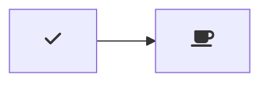
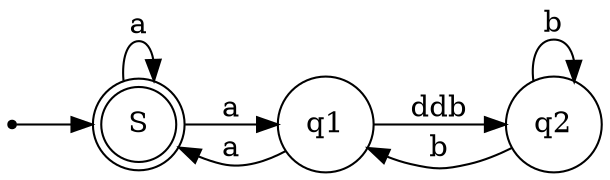

---
puppeteer:
    pdf:
        format: A4
        displayHeaderFooter: true
        margin:
            top: 1cm
            right: 1cm
            bottom: 1cm
            left: 1cm
    image:
        quality: 90
        fullPage: true
---

Sample Exporting instructions

# Markdown Reference

[[TOC]]


## Summary of symbols

- `*x*` italics
- `**x**` bold
- `~~strikethrough~~`
- `==mark==`
- `:emoji`
- `_underline`
- `[LinkText](Link)`
- `[InnerLinkText](#Inner-Link-Text)`
- ``
- `*[Abbr]: Abbreviations`
- `:(file.md)` include file in place
- - conflics with emoji
- `!!!include(file.md)!!!`
- - conflicts with Admonitions
- `!!!Admonition` [^jebbs.markdown-extended]
- `~Sub~script`
- `^super^script`  [^jebbs.markdown-extended]
- `[ ] [x]`  checkbox  [^jebbs.markdown-extended]
- `[[Ctrl+Esc]]` Keyboard Keys  [^jebbs.markdown-extended]
- `[^footnote]:`  [^jebbs.markdown-extended]
- `[^referenceToFootnote]`  [^jebbs.markdown-extended]
- `{style="color:red"}` Attributes [^jebbs.markdown-extended]
- `<!-- @import "your_file" -->` [^MarkdownPreviewEnhanced]
- `@import "your_file"`[^MarkdownPreviewEnhanced]


`[[TOC]]`


!!!note 
      !!!summary  summary  abstract  tldr
      !!!info todo info
      !!!tip tip hint 
      !!!success success check  done 
      !!!question question help faq
      !!!warning warning  caution
      !!!attention 
      !!!failure  failure fail missing  error
      !!!danger 
      !!!bug 
      !!!example example snippet
      !!!quote quote  cite
      !!!


## Add Image

Syntax:

``

      moosbr/vscode-markdown-imsize/raw/master/sample-image.png =200x100)

is interpreted as:

      <p></p>

using `imgSize` extension, and `Markdown Preview Enhanced`

`imgsize` can take the following format:

_**width x height**_

      "...e/raw/master/sample-image.png =200x100)"

 *  Note: Width or height can be omitted. In this case the aspect ratio is honored during resize.*

    -  image.png =200x)  **no height**
    -  image.png =x100)  **no width**


_**percentage**_

      "...ode-markdown-imsize/raw/master/sample-image.png =50%x)"


## Text Formatting

 Bold `**`
 Italic `*`

 Superscript surround with `^` eg.  23^2^ * 2^1/2^
   - does not work in code blocks

Subscript surround with `~` eg.  H~2~O

Strike out surround with `~~` eg. ~~strikeout~~ 


## Markdown Include:  [^jebbs.markdown-extended]


:(file.md)
!!!include(file.md)!!!

## Exporter [^jebbs.markdown-extended]

Find in command palette, or right click on an editor / workspace folder, and execute:

            Markdown: Export to File
            Markdown: Export Markdown to File

The export files are organized in out directory in the root of workspace folder by default.

### Export Configurations

You can configure exporting for multiple documents with user settings.

Further, you can add per-file settings inside markdown to override user settings, it has the highest priority:

```yaml
---
puppeteer:
    pdf:
        format: A4
        displayHeaderFooter: true
        margin:
            top: 1cm
            right: 1cm
            bottom: 1cm
            left: 1cm
    image:
        quality: 90
        fullPage: true
---
contents goes here...
```


See all available settings for [puppeteer.pdf](https://github.com/GoogleChrome/puppeteer/blob/v1.4.0/docs/api.md#pagepdfoptions)

, and [puppeteer.image](https://github.com/GoogleChrome/puppeteer/blob/v1.4.0/docs/api.md#pagescreenshotoptions)


### Exporting as HTML [^jebbs.markdown-extended]

Export to HTML
Copy HTML To Clipboard
Export to HTML with styles


Export & Copy
command


## Table Editing

Editing Helpers and Keys
Inspired by joshbax.mdhelper, but totally new implements.

Command	Keyboard Shortcut
Format: Toggle Bold	Ctrl+B
Format: Toggle Italics	Ctrl+I
Format: Toggle Underline	Ctrl+U
Format: Toggle Mark	Ctrl+M
Format: Toggle Strikethrough	Alt+S
Format: Toggle Code Inline	Alt+`
Format: Toggle Code Block	Alt+Shift+`
Format: Toggle Block Quote	Ctrl+Shift+Q
Format: Toggle Superscript	Ctrl+Shift+U
Format: Toggle Subscript	Ctrl+Shift+L
Format: Toggle Unordered List	Ctrl+L, Ctrl+U
Format: Toggle Ordered List	Ctrl+L, Ctrl+O
Table: Paste as Table	Ctrl+Shift+T, Ctrl+Shift+P
Table: Format Table	Ctrl+Shift+T, Ctrl+Shift+F
Table: Add Columns to Left	Ctrl+Shift+T, Ctrl+Shift+L
Table: Add Columns to Right	Ctrl+Shift+T, Ctrl+Shift+R
Table: Add Rows Above	Ctrl+Shift+T, Ctrl+Shift+A
Table: Add Row Below	Ctrl+Shift+T, Ctrl+Shift+B
Table: Move Columns Left	Ctrl+Shift+T Ctrl+Shift+Left
Table: Move Columns Right	Ctrl+Shift+T Ctrl+Shift+Right
Table: Delete Rows	Ctrl+Shift+D, Ctrl+Shift+R
Table: Delete Columns	Ctrl+Shift+D, Ctrl+Shift+C
Looking for Move Rows Up / Down? You can use vscode built-in Move Line Up / Down, shortcuts are alt+↑ and alt+↓

Table Editing
tableEdit

moveCols

Move columns key bindings has been changed to ctrl+shift+t ctrl+shift+left/right, due to #57, #68

Paste as Markdown Table
Copy a table from Excel, Web and other applications which support the format of Comma-Separated Values (CSV), then run the command Paste as Markdown Table, you will get the markdown table.


pasteTable option


Move columns key bindings has been changed to [[ctrl]]+[[shift]]+[[t]] [[ctrl]]+[[shift]]+[[left/right]], due to #57, #68

Paste as Markdown Table
Copy a table from Excel, Web and other applications which support the format of Comma-Separated Values (CSV), then run the command Paste as Markdown Table, you will get the markdown table.


## Footnotes: [^jebbs.markdown-extended]


markdown-it-footnote


Reference with `[^x]` where x is any flag to id it.  Number or text.

Call it up with `[^x]:` the footnote.  Note the colon.  [^1]

[^1]: example.

Here is a footnote reference,[^1] and another.[^longnote]

[^1]: Here is the footnote.
[^longnote]: Here's one with multiple blocks.
Here is a footnote reference,[1] and another.[2]

## markdown-it-table-of-contents  [^jebbs.markdown-extended]

`[[TOC]]`


## markdown-it-abbr  [^jebbs.markdown-extended]

*[HTML]: Hyper Text Markup Language
*[W3C]:  World Wide Web Consortium
The HTML specification
is maintained by the W3C.
The HTML specification is maintained by the W3C.

## markdown-it-deflist  [^jebbs.markdown-extended]

Apple
:   Pomaceous fruit of plants of the genus Malus in the family Rosaceae.
Apple
Pomaceous fruit of plants of the genus Malus in the family Rosaceae.


## markdown-it-sup   [^jebbs.markdown-extended]

29th
29^th^

## markdown-it-sub  [^jebbs.markdown-extended]

 H2O
 H~2~O

## markdown-it-checkbox  [^jebbs.markdown-extended]

[ ] unchecked
[x] checked


## markdown-it-attrs [^jebbs.markdown-extended]

item **bold red**{style="color:red"}
item bold red

## markdown-it-kbd [^jebbs.markdown-extended]

[[Ctrl+Esc]]

`[[Ctrl+Esc]]`

Ctrl+Esc

## markdown-it-underline [^jebbs.markdown-extended]

_underline_
underline

## markdown-it-container [^jme]

::::: container
:::: row
::: col-xs-6 alert alert-success
success text
:::
::: col-xs-6 alert alert-warning
warning text
:::
::::
:::::

container-demo.png

## Markdown mark

[Link to site](https://www.npmjs.com/package/markdown-it-mark)


~~!!!fail doesnt seem to work.~~

Works, may be incompatible with white background or non-inclusive css files.

Seems included in [^jme] 

==mark==

var md = require'markdown-it')()
            .use(require('markdown-it-mark'));
 
md.render('==marked==')


## Multi-MD table  

!!!fail doesnt seem to work.

[Link to Site](https://www.npmjs.com/package/markdown-it-multimd-table)


`|   Markdown   | Rendered HTML |
|--------------|---------------|
|    *Italic*  | *Italic*      | \
|              |               |
|    - Item 1  | - Item 1      | \
|    - Item 2  | - Item 2      |
`|    ```python | ```python       \`
`|    .1 + .2   | .1 + .2         \`
`|    ```       | ```           |`


Stage | Direct Products | ATP Yields
----: | --------------: | ---------:
Glycolysis | 2 ATP ||
^^ | 2 NADH | 3--5 ATP |
Pyruvaye oxidation | 2 NADH | 5 ATP |
Citric acid cycle | 2 ATP ||
^^ | 6 NADH | 15 ATP |
^^ | 2 FADH2 | 3 ATP |
**30--32** ATP |||
[Net ATP yields per hexose]


## Disable Plugings in jebbs Markdown Extended

Disable Plugins
To disable integrated plugins, put their names separated with ,:

`"markdownExtended.disabledPlugins": "underline, toc"`

## Markdown Styles [^jme]

[Markdown Custom Styles](https://code.visualstudio.com/Docs/languages/markdown#_using-your-own-css)


(Rendered with style bootstrap, to see the same result, you need the follow config)

    "https://maxcdn.bootstrapcdn.com/bootstrap/4.0.0/css/bootstrap.min.css"

    "https://use.fontawesome.com/releases/v5.7.1/css/all.css"


## Markdown Attributes [^jme]

markdown-it-attrs
item **bold red**{style="color:red"}

`{style="color:red"}`


## Mermaid [^2]




### Syntax Highlighting 

Mermaid Markdown Syntax Highlighting
bpruitt-goddard.mermaid-markdown-syntax-highlighting

## Markdown Emojii [^3] [^jebbs.markdown-extended]

:emoji:

[Emoji Cheatsheet](https://www.webfx.com/tools/emoji-cheat-sheet/)


## GraphViz [^4]



## Markdown Script [^ClickToRun]

Adds Click to run/ click to copy links to code blocks

## Markdown Index

markdown-index
legendmohe.markdown-index

Adds index numbers to TOC and headers

Markdown Navigation
alanwalk.markdown-navigation Adds inner links to TOC

## Markdown Preview Enhanced

!!!faq [Documnentation for Markdown Preview Enhanced](https://shd101wyy.github.io/markdown-preview-enhanced/#/)

[MPE-main](https://marketplace.visualstudio.com/items?itemName=shd101wyy.markdown-preview-enhanced)


### Importing Files
`<!-- @import "your_file" -->`[^MarkdownPreviewEnhanced]
`@import "your_file"`[^MarkdownPreviewEnhanced]

easy, right :)

`<!-- @import "your_file" -->`[^MarkdownPreviewEnhanced] is also valid.

Supported file types

- `.jpeg`(`.jpg`, `.gif`, `.png`, `.apng`, `.svg`, `.bmp`file will be treated as markdown image.

- `.csv`file will be converted to markdown table.

- `.mermaid` file will be rendered by mermaid.

- `.dot`file will be rendered by viz`.js`(graphviz).

- `.plantuml`(`.puml` file will be rendered by PlantUML.

- `.html`file will be embedded directly.

- `.js`file will be included as <script src="your_js"></script>.

- `.less`and `.css`file will be included as style.

- Only local `.less` file is currently supported.
  - `.css`file will be included as <link rel="stylesheet" href="your_css">.

- `.pdf`file will be converted to svg files by pdf2svg and then be included.

- markdown file will be parsed and embedded directly.
- All other files will be rendered as code block.


test:

<!-- @import "chart.js" -->

<!-- @import "./chart.js" -->

<!-- @import chart.js -->

<!-- @import ./chart.js -->

@import "./chart.js"

@import ./chart.js

## Chart.js

```chart
{
  "type": "pie",
  "data": {
    "labels": [
      "Red",
      "Blue",
      "Yellow"
    ],
    "datasets": [
      {
        "data": [
          300,
          50,
          100
        ],
        "backgroundColor": [
          "#FF6384",
          "#36A2EB",
          "#FFCE56"
        ],
        "hoverBackgroundColor": [
          "#FF6384",
          "#36A2EB",
          "#FFCE56"
        ]
      }
    ]
  },
  "options": {}
}
```

### PlantUML

Markdown PDF
yzane.markdown-pdf

also with mermaid, math and extensive output

```uml
@startuml
Bob -[#red]> Alice : hello
Alice -[#0000FF]->Bob : ok
@enduml
```

### Pandoc Rendering

Pandoc Markdown Preview
**kzvi.pandoc-markdown-preview**


[^jebbs.markdown-extended]: Markdown Extended jebbs.markdown-extended

[^2]: Markdown Preview Mermaid Support bierner.markdown-mermaid


[^3]: Markdown Emoji  bierner.markdown-emoji


[^4]: Graphviz Markdown Preview
geeklearningio.graphviz-markdown-preview


[^ClickToRun]: Markdown Script axetroy.vscode-markdown-script

[^MarkdownPreviewEnhanced]: 	Makdown Preview Enhanced  shd101wyy.markdown-preview-enhanced


## Latex

$$\displaystyle{a\over b}\above1pt\displaystyle{c\over d}$$

$${a\over b}\above1pt{c\over d}$$


\vadjust
 ‘\par\eject’.
 \vfill\eject

 \smallskipor\medskipor\bigskip

 \tag{1} adds a number on the left.  Another command moves it to the right.
$$x^2-y^2 = (x+y)(x-y).\eqno(15)$$
`\eqno(#)` does too
`\leqno(16)` puts irt on the left.

Notice that you always give the equation number second, even when it is goingto appear at the left.  Everything from the`\eqno `or`\leqno` command to the `$$`that ends the display is the equation number. 


Math in $...$

^ super script, by default ==  1 char.  If more use {}
_ sub script.
 $2^{2^x}$
 $x_2y_2$
 
`^\prime`  $y_3^{\prime\prime\prime}$  3 primes

$\sqrt{x+2}$
$\overline x+\overline y$
$\root 3 \of 2$
$\sqrt{x^3+\sqrt\alpha}$
$x\times y\cdot z$    x×y·z
$x\circ y\bullet z$x◦y•z
$x\cup y\cap z$x∪y∩z
$x\sqcup y\sqcap z$  xtyuz
$x\vee y\wedge z$x∨y∧z
$x\pm y\mp z$

It is important to distinguish×(\times) fromX(X) and fromx(x);

$\hat a$ˆa  `\^`,
$\check a$ˇa  ``\v``
$\tilde a$ ̃a \~
$\acute a$ ́a \’,
$\grave a$`a  \‘
$\dot a$ ̇a   `\.`
$\ddot a$ ̈a  `\"`
$\breve a$ ̆a  `\u`
$\bar a$ ̄a  `\=`
$\vec a$~a


t’s usually a good idea to define special control sequences for accented lettersthat you need frequently. For example, you can put


        \def\Ahat{{\hat A}}
        \def\chat{{\hat c}}
        \def\scheck{{\check s}}
        \def\xtilde{{\tilde x}}
        \def\zbar{{\bar z}}

TEX actually has eight different styles in which it can treatformulas, namely

display style(for formulas displayed on lines by themselves)
text style(for formulas embedded in the text)
script style(for formulas used as superscripts or subscripts)
scriptscript style    (for second-order superscripts or subscripts)

and four other “cramped” styles that are almost the same except that exponentsaren’t raised quite so much.  For brevity we shall refer to the eight styles as

D, D′, T, T′, S, S′,SS,SS′,

here **D** is display style, **D′**is cramped display style,**T** is text style, etc.

The normal way to typeset a formula with TEX is to enclose it in dollarsigns
`$...$;` this yields the formula in **text style** (style T). 

Or you can enclose it indouble dollar signs `$$...$$;` this displays the formula in **display style (styleD)**


### Math (Tex) Delimeters

Input   Delimiter
`(` left parenthesis:  (

`)` right parenthesis:  )
`[ `or`\lbrack`left bracket:  [

`]`or`\rbrack`right bracket:  ]
`\{`or`\lbrace`  left curly brace:{

``\}` or`\rbrace`right curly brace:}
`\l` floorleft floor bracket:
`\r` floorright floor bracket: 
`\lceil` left ceiling bracket:
`\rceil` right ceiling bracket:
`\langleleft` angle bracket:  〈
`\rangleright` angle bracket: 〉
`/slash`: `/`
`\backslash`  reverse slash: \
`|`or`\vert`vertical bar:|
`\|` or`\Vert`double vertical bar:‖
`\uparrow`  upward arrow:  ↑
``\Uparrow`  double upward arrow:⇑
`\downarrow`   downward arrow:  ↓  
`\Downarrow`  double downward arrow: ⇓   
`\updownarrow`   up-and-down arrow:    
`\Updownarrow`   double up-and-down arrow: 


n  order  to  get  a  slightly  larger  version  of  any  of  these  symbols,  justprecede them by ‘`\bigl`’ (for opening delimiters) or ‘`\bigr`’ (for closing ones).


`\bigl` and ``\bigr` 20% bigger
`\Bigl` and  `\Bigr` 50 % bigger than big
`\biggl` and ``\biggr` 100% bigger than normal
`\Biggl` and  `\Biggr` 250 % bigger than big


$$1+\left(1\over1-x^2\right)^3$$

\left and \right lets Tex determine thesize

 Each item in amath list is one of the following types of things
 - **an atom** (to be explained momentarily)
 - **horizontal material** (a rule or discretionary or penalty or “whatsit”)
 - **vertical material** (from\markor\insertor\vadjust)
 - **a glob of glue** (from\hskipor\mskipor\nonscript)
 - a **kern** (from\kernor\mkern)
 - a **style change** (from\displaystyle,\textstyle, etc.)
 - a **generalized fraction** (from\above,\over, etc.)
 - a **boundary** (from\leftor\right)
 - a **four-way choice** (from\mathchoice).

 `\mathsurround=1pt`  spreads formuila horizontally 1pt.
 `\rm` roman (non italic font)
 `\bf` bold font
 `\cal` Caligraphic font
 `\mit` math italic  math italic letters are a little wider, and the spacing is different
 -  this works betterin most formulas, but it fails spectacularly when you try to type certain italic words


 - `\,`thin space  (normally 1/6 of a quad)
 - `\>` medium space  (normally 2/9 of a quad)
 - `\;` thick space  (normally 5/18 of a quad)
 - `\!` negative thin space  (normally−1/6 of a quad)


 ‘$$\hbox{Displayed Text}$$

 Formulas and text were combined in this case by typing
 
 $$X_n=X_k \qquad\hbox{if and only if}\qquadY_n=Y_k \quad\hbox{and}\quad Z_n=Z_k.$$