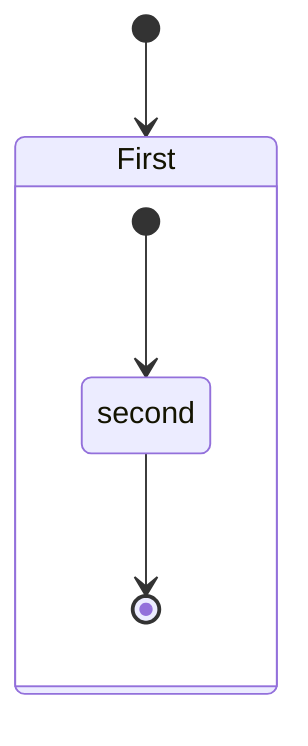

---
puppeteer:
    pdf:
        format: A4
        displayHeaderFooter: true
        margin:
            top: 1cm
            right: 1cm
            bottom: 1cm
            left: 1cm
    image:
        quality: 90
        fullPage: true
---


# Lab 3 Huffman Encoding

Andrew Timmons
Data Structures 
Project 3


## General Overview


<!-- @import "[TOC]" {cmd="toc" depthFrom=1 depthTo=6 orderedList=false} -->

<!-- code_chunk_output -->

- [Lab 3 Huffman Encoding](#lab-3-huffman-encoding)
  - [General Overview](#general-overview)
    - [Directory Structure](#directory-structure)
  - [Class Overview](#class-overview)
  - [File Management](#file-management)
  - [Program Intro](#program-intro)
  - [Parsing Data](#parsing-data)
  - [Organizing the data](#organizing-the-data)
  - [Encoding](#encoding)

<!-- /code_chunk_output -->


### Directory Structure

!!!Summary  
                              Folder PATH listing
      Volume serial number is E4CA-B907
      C:.
      ├───.idea
      │   ├───artifacts
      │   ├───codeStyles
      │   ├───inspectionProfiles
      │   └───libraries
      ├───bak
      │   └───removed
      ├───doc
      ├───lib
      ├───Logs
      ├───META-INF
      ├───out
      │   └───artifacts
      │       ├───Derelict_Classes
      │       │   └───DerelictClasses
      │       ├───Graphical_Resources
      │       │   └───res
      │       │       ├───1.5x
      │       │       └───3X
      │       ├───InteralFiles
      │       │   ├───artifacts
      │       │   ├───codeStyles
      │       │   ├───DerelictClasses
      │       │   ├───inspectionProfiles
      │       │   ├───libraries
      │       │   ├───META-INF
      │       │   ├───org
      │       │   │   └───timmons
      │       │   │       └───datastructures
      │       │   ├───RemovedClasses
      │       │   ├───report
      │       │   │   └───dsRes
      │       │   └───res
      │       │       ├───1.5x
      │       │       └───3X
      │       ├───Internal_Project_Files
      │       │   ├───artifacts
      │       │   ├───codeStyles
      │       │   ├───DerelictClasses
      │       │   ├───inspectionProfiles
      │       │   ├───libraries
      │       │   ├───META-INF
      │       │   ├───org
      │       │   │   └───timmons
      │       │   │       └───datastructures
      │       │   │           └───graph
      │       │   │               └───paintables
      │       │   ├───RemovedClasses
      │       │   ├───report
      │       │   │   └───dsRes
      │       │   ├───res
      │       │   │   ├───1.5x
      │       │   │   └───3X
      │       │   └───Sources
      │       │       └───main
      │       │           └───java
      │       │               └───org
      │       │                   └───timmons
      │       │                       └───datastructures
      │       │                           └───graph
      │       │                               └───paintables
      │       ├───P4encoding_jar
      │       │   ├───Logs
      │       │   ├───P4encoding
      │       │   │   ├───artifacts
      │       │   │   ├───codeStyles
      │       │   │   ├───DerelictClasses
      │       │   │   ├───inspectionProfiles
      │       │   │   ├───libraries
      │       │   │   ├───META-INF
      │       │   │   ├───org
      │       │   │   │   └───timmons
      │       │   │   │       └───datastructures
      │       │   │   ├───RemovedClasses
      │       │   │   ├───report
      │       │   │   │   └───dsRes
      │       │   │   ├───res
      │       │   │   │   ├───1.5x
      │       │   │   │   └───3X
      │       │   │   └───Sources
      │       │   │       └───main
      │       │   │           └───java
      │       │   │               └───org
      │       │   │                   └───timmons
      │       │   │                       └───datastructures
      │       │   └───P4encoding_2
      │       │       ├───artifacts
      │       │       ├───codeStyles
      │       │       ├───DerelictClasses
      │       │       ├───inspectionProfiles
      │       │       ├───libraries
      │       │       ├───META-INF
      │       │       ├───org
      │       │       │   └───timmons
      │       │       │       └───datastructures
      │       │       ├───RemovedClasses
      │       │       ├───report
      │       │       │   └───dsRes
      │       │       └───res
      │       │           ├───1.5x
      │       │           └───3X
      │       ├───Report
      │       │   └───Report
      │       ├───Report1
      │       │   └───Report
      │       ├───res
      │       │   └───res
      │       │       ├───1.5x
      │       │       └───3X
      │       ├───Sources
      │       │   ├───org
      │       │   │   └───timmons
      │       │   │       └───datastructures
      │       │   └───Sources
      │       │       └───main
      │       │           └───java
      │       │               └───org
      │       │                   └───timmons
      │       │                       └───datastructures
      │       │                           └───graph
      │       │                               └───paintables
      │       └───zDerelictClasses
      │           └───DerelictClasses
      ├───res
      │   ├───1.5x
      │   ├───1x
      │   ├───2x
      │   ├───3x
      │   ├───4x
      │   ├───6x
      │   ├───android
      │   │   ├───drawable-hdpi
      │   │   ├───drawable-mdpi
      │   │   ├───drawable-xhdpi
      │   │   ├───drawable-xxhdpi
      │   │   └───drawable-xxxhdpi
      │   └───ios
      │       ├───@1x
      │       ├───@2x
      │       └───@3x
      ├───src
      │   ├───main
      │   │   └───java
      │   │       └───org
      │   │           └───timmons
      │   │               └───datastructures
      │   │                   └───graph
      │   │                       └───paintables
      │   └───test
      │       └───java
      │           └───org
      │               └───timmons
      │                   └───datastructures
      └───target
          ├───classes
          │   ├───META-INF
          │   ├───org
          │   │   └───timmons
          │   │       └───datastructures
          │   │           └───graph
          │   │               └───paintables
          │   ├───RemovedClasses
          │   └───report
          │       └───dsRes
          ├───generated-sources
          │   └───annotations
          ├───maven-archiver
          └───maven-status
              └───maven-compiler-plugin
                  ├───compile
                  │   └───default-compile
                  └───testCompile
                      └───default-testCompile


                        
    There are some files that I have annotated ` *TRUNCATED*`. Basically, I took out some of the image directories so that this tree wouldn't take up pages and pages of the report, needlessly.  I will talk about the image directories briefly later, but they hold the images for the GUI in multiple sizes, hence the reason to truncate them (copies at 1x, 1.5x, 2x, 3x, etc...).

The project structure is seen above.  I did not really implement much testing in this project as I did in the last one.  It is still something I am trying to get a grasp of.  


!!!note: output files are found in `.\logs\` with the console output under `output##-##-##` and the debug/log/error output in the `java0.log` & `java1.log`.


## Class Overview

      Folder PATH listing
      Volume serial number is E4CA-B907
      C:.
      │   App.java
      │   CellBoldRendmpl.java
      │   CustomJTable.java
      │   Decoder.java
      │   Encoder.java
      │   ExceptionGroup.java
      │   FileChooser.java
      │   GraphicalElements.java
      │   HTMLLister.java
      │   HTMLOutStream.java
      │   Huffcoder.java
      │   IconSz.java
      │   ListViewer.java
      │   LogLister.java
      │   LogMan.java
      │   Node.java
      │   NullStream.java
      │   Processor.java
      │   Sys.java
      │   TableRendererImpl.java
      │   Token.java
      │   TokenQueue.java
      │   Tree.java
      │   TreeBrowserModel.java
      │   TreeBuilder.java
      │   TreeListener.java
      │   TreeLister.java
      │   
      └───graph
          │   GDimension.java
          │   GNode.java
          │   GraphicalTree.java
          │   GTree.java
          │   Location.java
          │   Tree.java
          │   
          └───paintables
                  Circle.java
                  Line.java
                  PaintableObjects.java
                  Text.java
                  

- `App.java` - the primary class for the program.  Drives the whole thing.
- `Sys.java` - an abstract class that stores `final` settings, and parameters.  I know some people frown on having a single `abstract` class or `interface` that only serves to store things like this and call it bad form, while others say that it is a good practice.  In the end, as I write more, I find that I like it.  It is easy to reference anything stored there, with a quick qualified call (hence the short name), and I know where each of the settings are.  In the case of a  GUI, I would likely have a second referencing *magic number* type values for that aspect of the program.  There are a few useful methods thrown in there as well.  I was thinking a useful thing to do moving forward is to have a class that I throw frequently used methods into for these assignments, then I can start with a blank program and my abstract class and pull in methods that I have written previously.
- `LogMan.java` - this handles a lot of the work of the loggers, though in retrospect, much of it is superfluous as I experimented with logs back when I thought I was way ahead of the ball on the project.  Some of it was copied from a previous project in which I tried logging, though very little.
- `Processor.java` - handles the file opening and parsing of the program. I had envisioned this a universal file opener, that if it took a slightly malformed path, could manage it, adjust it on the fly and make it work.  When I was writing this over a month ago, I really didn't know enough to do it, and it has way too much boilerplate.  I know a fair size bit more now and I think I could do much better.  It also handles the parsing of the file.
- `NullStream` - initially it was supposed to discard Console output.  Then what I really wanted to do was to redirect the console output to an HTMLList Pane in the GUI, so you could have a GUI based console.  I think I nearly had this working, but had to abandon it due to time.

- `Token` - stores the object of the letters and the values and provides methods for accessing them.
- `TokenQueue` - stores a priorityQueue of the objects for use in encoding.  Essentially a linked stack.
- `Node` -  Extends Token, to allow Token to become a tree node.  Allows the Node to operate like a stack, or Linked List, with previous and next fields, and also like a tree Node, with Parent, left child, and right child fields.
- `HuffCoder` - Takes the completed TokenQueue and adds it to a tree.
- `TreeLister` - Take the tree and does pre-order traversal in order to encode the Huffman Encoding.

- `TreeBuilder`, `GraphicalOutput` `GraphicalElements`, `TreeListener`, `TreeTable` all implement aspects of the GUI from the interactive tree to the interactive buttons.

- `TableRendererImpl` - Changing the look and font of text in the GUI objects is not exactly straight forward.  But I did eventually figure it out, first in JPane, in the message dialogue, then as the table fomatter here.


`pkg Graph`, and `pkg graph.paintables` was an attempt to actually draw a tree on a canvas.  I initially envisioned that this should be easy, as each node would be drawn, saw 1/3 left and 1/3 right the X pos of the node.  But it very quickly started getting more complicated than I expected.  There are also a number of classes in the deprecated folder that I wrote and removed. 

## File Management

I spent a great deal of time managing the output and input of this program.  I still struggle with IO operations and I think thats why I focus on it so much.  I put the Logger (java.util.Logger) class back to work in this program.  In theory it is supposed to help with debugging, but I find I spend vastly more time battling with it than I do actually debugging it.  What also happens is I am not consistent as I should be in what output gets sent to System.err,  System.out, and the various Logs.  I keep hoping that I will become facile at logs and be able to use that easily moving forward.  Instead, I ended up getting this in an additional day late because I could not get the log output to shift from the console to the file as expected.  The relevant class in this case is `LogMan`.  I will try not to spend too much time on the nuances here, but its worth a brief discussion based on the hours I battled with it.  In addition the class is a bit of a mess, with all the last second reconfiguring.

The first call in the program instantiates LogMan.

```java
 public static void main( String[] args )
    {
      LogMan logMan = new LogMan(8);
      LogMan.redirectConsole();
      
```
I generate the appropriate directory if its missing - called "Logs" which should be in the executing directory of the program.  It does this through a call to `System.getProperty( "user.dir" );` Then it removes the `ConsoleHandler` from the Global Logger, which is the default method.  I learned that by default, all logging calls are passed up to the global, where the default handler, `ConsoleHandler`, grabs them and writes them to the *PrintStream* `System.err`.  This was difficult to solve.  I kept getting output anyway.  Another critical point is that anything with a `java.util.Logging.Level` above or equal to `Level.CONFIG` is written to the console anyway.  That was part of the problem.  I create a `FileHandler` and `Filter` and `Formatter` and add that handler to the Global Logger.  That still didn't give File Output.  I then tried adding the `FileHandler` to all of the loggers which I was able to access through the `LogManager` class. 

```java
     LogManager logManager = LogManager.getLogManager();
  
    for( Enumeration<String> loggerNames = logManager.getLoggerNames() ;
         loggerNames.hasMoreElements() ; ){
      String name       = loggerNames.nextElement();
      Logger thisLogger = Logger.getLogger( name );
      for( Handler handler : thisLogger.getHandlers() ){
        if( handler instanceof ConsoleHandler ){
          thisLogger.removeHandler( handler );
        }
      }
      //tell all the kids to listen to their parents.
      thisLogger.setUseParentHandlers( true );
      thisLogger.addHandler( fileHandler );
    }
```

Iterating through each Logger, removing ConsoleHandler and adding FileHandler still didn't work.  Finally, buried in a *StackOverflow* post, and in several others, a rather vague mention of properties was mentioned.  Complicating things, Logger also allows reading settings from a Properties file.  After heading down that path for way too long, I finally hit upon, 

```java
       System.setProperty( "java.util.logging.SimpleFormatter.format" ,
            getFormatString( formatOption ) );
      System.setProperty( "java.util.logging.FileHandler.pattern" ,
            tempFile.getAbsolutePath() );
```
as the solution. However, not I think I get 2 copies out to a file.  Yet, with the deadline well passed, I think I'll have to leave well enough alone.  Here, I also got the Formatter to work as well.  Each of those issues I must have spent greater than 8 hours on. 

I also redirect the console `PrintStream` to a class I wrote that extends `PrintStream`: `NullStream`.  NullStream was intended to be a dummy class that I could print to, just as in the class it extends, PrintStream.  The intention was that the  strings passed to `PrintStream` would add to a String array(initially) and  later a `Vector<String>` that would be taken into the  * htmlPane, in the bottom third of the GUI.  It probably looks like just a narrow white band at this point.  The hope was that I could write this  list to act like a console, such that the dialogue would be printed there.  I had also intended to write a Formatter class, to handle Log values in Green and Err output in Red, as I did for the JTable class in `TableRendererImpl`.

## Program Intro 

The program starts with then intro message.


    Huffman Encoding
      Andy Timmons 2020No Arguments are required.  By default the program pulls values from './res/*'.  In the GUI the Open and Save mechanisms are very nearly fully implemented, but not quite and aren't currently functional.  The program will accept the following parameters.
      [-v] DISABLES verbose mode
      [-d] DISABLES certain debugging messages,
      [-c] redirects the logging from a file in ./log/ to the console.
      [-o] redirects the general output from a file to the console. Default is ./log/output<date>.txt  
      [-l] Disables most of the logging calls.


    As can be guessed, many of these calls have side-effects on others, I was not very consistent in their writing.  -v -l disables most of the program status messages.  In general though, -v, -l, -c are all superfluous to the program, as are -d.  The relevant output is either output to the console (and gui), or to the file, and gui.  I probably should have put a flag to stop the GUI (in case of compatibility errors) but that is on the list of the many things that I wanted to implement, and yet the program has already gotten so complicated that it is quite late.  So, with the date past, I decided that I would only implement centrally critical items.

Values can be edited in ./res/ in the relevant files- to add additional strings to decode. etc.

## Parsing Data

Following the data though, the `Processor` class spends a lot of time checking the path, then finally begins parsing.  I opted to use RegEx matching here, though I did worry about whether it would be using another class, as Dr. Chlan does not want us to do.

The relevant pattern is thus, however:


	`"([\\s]*?)([A-Za-z])([\\s]*?)([\\W\\S])([\\s]*?)([\\d]{1,2})(.*$)"`

Though I am sure you are familiar with RegEx, an overview is worthwhile. Each parenthetical group obviously makes a match group. 

1. `([\\s]*?)`: 0 or more (Lazy-e.g. as few as possible) space characters 
2. `([A-Za-z])`: An alphabetic character - in the range A-Z,a-z 
3. `([\\s]*?)`: Same as 1 
4. `([\\W\\S])`: any Non-WhiteSpace, and Non-Word character 
5. `([\\s]*?)`: Same as 1 
6. `([\\d]{1,3})`: A decimal number, with a length 1:3 chars 
7. `(.*$)`: Followed by any character or not to the end of the line

The method is shown below, with superfluous logging and debugging lines removed.  I did opt to use Scanner as well in this case, rather than Character Reader like I did in one of the previous assignments, where I wanted to get as close to 'bare metal' as possible.  In this case, I did take advantage of some higer complexity classes.

```java
 public static TokenQueue processFile( TokenQueue tokenQueue ) throws FileNotFoundException , IOException {
		String REGEX_STRING = "([\\s]*?)([A-Za-z])([\\s]*?)([\\W\\S])([\\s]*?)([\\d]{1,3})(.*$)";
		Pattern pRegEx = Pattern.compile( REGEX_STRING );
		File fileRead = new File( f_workingDirectory , f_filename );
		Scanner fileScanner = new Scanner( fileRead );
		if ( fileScanner.hasNextLine( ) ) {

				do {
						String line = fileScanner.nextLine( );
						Scanner lineScanner = new Scanner( line );
						lineScanner.findInLine( pRegEx );
						MatchResult match = lineScanner.match( );

						String charMatch = match.group( 2 ).trim( );
						int intMatch = Integer.parseInt( match.group( 6 ).trim( ) );

						lineScanner.close( );
				}
				while ( fileScanner.hasNext( ) );
		} else {
				fileScanner.close( );
		}

		fileScanner.close( );
		return tokenQueue;
}
```
## Organizing the data

Finally, though, we get to the data structures.  Here each line is read, it has 2 values, a letter and a value.  For this I created the class `Token` to hold them.  It really just creates an Object that contains these items.

These then get pushed to `TokenQueue`, which is a stack, or rather, as the name suggests, a **queue**.  The tokens are sorted internally by value.  Below is a string representation of that action.

    H( Len=1 )>-{A}~-<T
                  ^new Node
    H( Len=2 )>-{B}~{A}~-<T
                  ^new Node
    H( Len=3 )>-{B}~{C}~{A}~-<T
                      ^new Node
    H( Len=4 )>-{D}~{B}~{C}~{A}~-<T
                  ^new Node
    H( Len=5 )>-{D}~{B}~{C}~{A}~{E}~-<T
                                  ^new Node
    H( Len=6 )>-{D}~{F}~{B}~{C}~{A}~{E}~-<T
                      ^new Node
    H( Len=7 )>-{D}~{F}~{G}~{B}~{C}~{A}~{E}~-<T
                          ^new Node
    H( Len=8 )>-{D}~{F}~{G}~{B}~{H}~{C}~{A}~{E}~-<T
                                  ^new Node
    H( Len=9 )>-{D}~{F}~{G}~{I}~{B}~{H}~{C}~{A}~{E}~-<T
                              ^new Node
    H( Len=10 )>-{J}~{D}~{F}~{G}~{I}~{B}~{H}~{C}~{A}~{E}~-<T
                  ^new Node
    H( Len=11 )>-{J}~{K}~{D}~{F}~{G}~{I}~{B}~{H}~{C}~{A}~{E}~-<T
                      ^new Node
    H( Len=12 )>-{J}~{K}~{D}~{F}~{G}~{I}~{B}~{H}~{C}~{A}~{L}~{E}~-<T
                                                          ^new Node
    H( Len=13 )>-{J}~{K}~{D}~{F}~{G}~{I}~{B}~{H}~{C}~{M}~{A}~{L}~{E}~-<T
                                                      ^new Node
    H( Len=14 )>-{J}~{K}~{D}~{F}~{G}~{I}~{B}~{H}~{C}~{M}~{A}~{L}~{N}~{E}~-<T
                                                                  ^new Node
    H( Len=15 )>-{J}~{K}~{D}~{F}~{G}~{I}~{B}~{H}~{C}~{O}~{M}~{A}~{L}~{N}~{E}~-<T
                                                      ^new Node
    H( Len=16 )>-{J}~{K}~{D}~{F}~{P}~{G}~{I}~{B}~{H}~{C}~{O}~{M}~{A}~{L}~{N}~{E}~-<T
                                  ^new Node
    H( Len=17 )>-{Q}~{J}~{K}~{D}~{F}~{P}~{G}~{I}~{B}~{H}~{C}~{O}~{M}~{A}~{L}~{N}~{E}~-<T
                  ^new Node
    H( Len=18 )>-{Q}~{J}~{K}~{D}~{F}~{P}~{G}~{I}~{B}~{H}~{C}~{O}~{M}~{A}~{L}~{N}~{R}~{E}~-<T
                                                                                  ^new Node
    H( Len=19 )>-{Q}~{J}~{K}~{D}~{F}~{P}~{G}~{I}~{B}~{H}~{C}~{O}~{M}~{A}~{L}~{N}~{R}~{S}~{E}~-<T
                                                                                      ^new Node

It is truncated above due to space.  I have another `toString()` method that also showed the values, than in many ways was more useful, but due to space, I did not include that here.  Though, perhaps I should have.

I played with this tree a great deal.  It went through many iterations as I designed and build the data structures for this project.  Unfortunately, I started this project early- a few weeks early, since I am generally too prone to playing around and perfectionism and tend to get things in late.  As I am getting close to the deadline now, and I was trying to improve a class to be a singleton class, and now nothing works and I cant for the life of me figure out how… then I suspect it will be late anyway.  However, I am sure that the extra time spent on the project will show anyhow.  I should have focused on the critical parts first before messing around I guess.  Anyway-  I started out writing a Stack class- a traditional stack.  Then I tried to write a tree class.  I got each of these working independently, but the difficult part was the ability to A) pass data in between the two items, and B) be able to merge the object.
For this I came up with the `Node` class.


Before that though, `Huffcoder` class takes the queue and breaks it back down into combined nodes. This is shown below. This is done following the rules of the encoding.

The Token class is then later extended by the `Node` Class.  The `Node` class is special because it can take the Token object and allow Token to become a tree node.  Allows the Node to operate like a stack, or Linked List, with previous and next fields, and also like a tree Node, with Parent, left child, and right child fields.  So, now we can can pop the objects directly off the stack and onto the tree.  In this way there is no Node additional class for Queue vs. Tree.  Initially I had `Token` extended by `Node` extended by `TokenQueue` (under a different Name) -> and then variously a Tree extending `Node` or using `Node`, or extending `TokenQueue`.  After a lot of time working on this and a bit better grasp on objects I just made the Node the class in and off itself.  There is a single recursive method to build the tree, and a single iterative method to build the Queue.  Likewise there is a semi-recursive method that converts the Queue to a tree.  The Node is just an object with 5 additional Node pointers-   `Node left`, `Node right`, `Node next`, `Node previous`, and `private Node root`.  I left the fields public, as there really wasn't a reason to shield them from usage.  This made the class and code much easier and quicker.  Of course, I did do it every hard way imaginable first.

The class with the functional methods to break down then queue and build up the tree is `HuffCoder`.  It may be a bit opaque how HuffCoder works, as I was in an 'elegant' code writing mood, which generally means I try and make things as brief (and thus opaque) as humanly possible.

The fields `TreeLister completedTree` and `TokenQueue decodedTree` hold the fully formed tree.  These are essentially the same object with the relationship being, explicitly, `TokenQueue decodedTree = completedTree.reEncode( rootNode );`.  The latter is used to build the table of binary.


                                                                      ^new Node
    H( Len=20 )>-{P}~{YZQX}~{G}~{U}~{I}~{B}~{H}~{C}~{O}~{M}~{A}~{KJV}~{L}~{W}~{DF}~{N}~{T}~{R}~{S}~{E}~-<T
                                                                                ^new Node
    H( Len=19 )>-{G}~{U}~{I}~{B}~{H}~{C}~{O}~{M}~{A}~{KJV}~{L}~{W}~{DF}~{N}~{T}~{R}~{PYZQX}~{S}~{E}~-<T
                                                                                      ^new Node
    H( Len=18 )>-{I}~{B}~{H}~{C}~{O}~{M}~{A}~{KJV}~{L}~{W}~{DF}~{N}~{T}~{R}~{PYZQX}~{GU}~{S}~{E}~-<T
                                                                                      ^new Node
    H( Len=17 )>-{H}~{C}~{O}~{M}~{A}~{KJV}~{L}~{W}~{DF}~{N}~{T}~{R}~{PYZQX}~{GU}~{BI}~{S}~{E}~-<T
                                                                                  ^new Node
    H( Len=16 )>-{O}~{M}~{A}~{KJV}~{L}~{W}~{DF}~{N}~{T}~{R}~{PYZQX}~{GU}~{BI}~{CH}~{S}~{E}~-<T
                                                                                ^new Node
    H( Len=15 )>-{A}~{KJV}~{L}~{W}~{DF}~{N}~{T}~{R}~{PYZQX}~{GU}~{BI}~{CH}~{S}~{MO}~{E}~-<T
                                                                                ^new Node
    H( Len=14 )>-{L}~{W}~{DF}~{N}~{T}~{R}~{PYZQX}~{GU}~{BI}~{CH}~{S}~{MO}~{AKJV}~{E}~-<T
                                                                            ^new Node
    H( Len=13 )>-{DF}~{N}~{T}~{R}~{PYZQX}~{GU}~{BI}~{CH}~{S}~{MO}~{AKJV}~{LW}~{E}~-<T
                                                                          ^new Node
    H( Len=12 )>-{T}~{R}~{PYZQX}~{GU}~{BI}~{CH}~{S}~{MO}~{AKJV}~{LW}~{E}~{NDF}~-<T
                                                                          ^new Node
    H( Len=11 )>-{PYZQX}~{GU}~{BI}~{CH}~{S}~{MO}~{AKJV}~{LW}~{E}~{NDF}~{RT}~-<T
                                                                        ^new Node
    H( Len=10 )>-{BI}~{CH}~{S}~{MO}~{AKJV}~{LW}~{E}~{NDF}~{RT}~{GUPYZQX}~-<T
                                                                ^new Node
    H( Len=9 )>-{S}~{MO}~{AKJV}~{LW}~{E}~{NDF}~{RT}~{GUPYZQX}~{BICH}~-<T
                                                                ^new Node
    H( Len=8 )>-{AKJV}~{LW}~{E}~{NDF}~{RT}~{GUPYZQX}~{BICH}~{SMO}~-<T
                                                              ^new Node
    H( Len=7 )>-{E}~{NDF}~{RT}~{GUPYZQX}~{BICH}~{SMO}~{LWAKJV}~-<T
                                                        ^new Node
    H( Len=6 )>-{RT}~{GUPYZQX}~{BICH}~{SMO}~{LWAKJV}~{ENDF}~-<T
                                                      ^new Node
    H( Len=5 )>-{BICH}~{SMO}~{LWAKJV}~{ENDF}~{RTGUPYZQX}~-<T
                                              ^new Node
    H( Len=4 )>-{LWAKJV}~{ENDF}~{RTGUPYZQX}~{SMOBICH}~-<T
                                              ^new Node
    H( Len=3 )>-{RTGUPYZQX}~{SMOBICH}~{ENDFLWAKJV}~-<T
                                        ^new Node
    H( Len=2 )>-{ENDFLWAKJV}~{SMOBICHRTGUPYZQX}~-<T
                              ^new Node
    H( Len=1 )>-{ENDFLWAKJVSMOBICHRTGUPYZQX}~-<T
                  ^new Node
    █ENDFLWAKJVSMOBICHRTGUPYZQX(413)

I ran into several issues here, first I thought I had carefully thought through my decoding loop, but I was only geting a series of X's.  For every letter, it always ended up at X.  I solved that by figuring out that I was not resetting the position of the tree to the top, nor was I exiting my loops appropriately.  Initially, when decoding the strings that were included, I was getting numerous unexpected errors.  At first the values were not remotely close to what was expected.  I thought I had followed the instructions for sorting the nodes, or comparing nodes- but the tree, while functional, did not produce the expected translation.  I went back through the video, and through the code, and the criteria mentioned in the video are as follows:

1. * Smaller values always go to the left.
2. *  Break tie by putting the simpler one to the left.
3. *  then alphabetically, with the earlier value, going left.

I was only first comparing length (of the key, e.g. 'simplicity' as put in the lecture), failing that (if the lengths are equal, which is used as a proxy for the number of descendents), falls back to the natural (alphabetic) ordering.  I was not comparing values.  So adding that in, I got most of the way there.  However, I did not get exactly what I expected.  I was getting similar values, but not totally expected values.  

First Line: value:01011001010110011111011011�
Line result = EIEIOH
Attempting to decode given Strings


First Line: value:10110000101010011011101101100010110010101100010111000110111�
Line result = GKPHGBGEGLSWN
Attempting to decode given Strings


First Line: value:11111110001000111111101011111011001111111000100011111000001010000001110010111
Line result = MBRMCMDMBRMAERVL
Attempting to decode given Strings


First Line: value:1101101000010001111100011111101000000101100
Line result = HEKWSWORK

I also subsequently fixed the strings so that they correctly describe the values etc.  Some work had to be done to clean up the odd characters at the ends of the lines, characters that may be line breaks, carriage returns, or similar, but aren't quite.  I had numerous issues with character encoding that set me back in several ways that this may be related to.  Initially the file that I had saved from Blackboard with the input was encoded in an odd character encoding.  I am not sure if this is my error or another error.  This may be the same issue, with the character on the end being an artifact of changing the character encoding.  

Anyway that character is stripped of by using RegEx pattern matching again.  Returning to the previous topic, the above strings show nearly the correct translations, as seen in the first value. The last value is known and one I added in, from the work sheet- and says HelloWorld.

Several characters here are correct HE___WOR_x. 

Determinging this error was considerably tougher. For all practical purposes, moving through the tree was working correctly.  I finally had an insight where I realized that when things were added to the Queue, if they had the same value, and there were two nodes that equaled one another in values, e.g. a newly combined node with a value of 15, and an existing Node, disagreed on which actually came first, then you would pull two values in one case, and another two in another case, which would effectively push the expected node down the incorrect sub-branch.

I thought about this, and considered that the same criteria must be being used here, as is made when determining which goes left vs. right.  At this time I had one method in the `Token` class that implemented `Comparable` interface.  I had another method in the `Huffcoder` class that had the correct comparisons.  The previous method only compared based on value, and in most cases this works fine.  I added a new method in `Node` class implementing `Comparable` (which served to mask `Token` method) and replaced the method in `Huffcoder`. 

This finally gives the expeceted result.

## Encoding

Initially, I thought I had the encoding method done quickly.

It was relatively easy, I had already generated the binary, in a TreeMap<String, String> in order to have a simple data structure to add to the Table later.

I got binary, and it looked right.  But when I wanted to swap the output of the `Encoder` class to the `Decoder` class so that I could show that I used my own data, I got bizarre values.

I ended up implementing the encode method through a binary search method.  Which, given the course of the class is probably the intended method.

The recursive method is given below.

As mentioned in the doc, it works by appending a 1 for each move right and a 0 for each move left. It returns a null value for a failed search, and a string for a successful one.  A possible error state exists if the letter does not exist in the tree, but in this case I know that it does.  So, I did not handle it here.

```java
/**
   * Recursive method to turn a character into binary.
   * @param node
   * @param s - 
   *          the string that is built up incrementally, to generate the 
   *          binary, with each move left, adding a zero, and each move 
   *          right, adding a 1.  
   * @param value 
   * the string (of length 1 in this case) or letter to search for.
   * 
   * 
   * @return 
   *  a null value if the search course fails, and the string if successful. 
   *  If not a leaf, continue down the path,
   */
  static String preOrder( Node node , String s , String value ){
    if(node.isLeaf()){ //preOrder
      if(node.getLetters().equals( value )){
        return s;
      } else return null;
    }else{ //if its a leaf, dont even check.
      if( node.hasLeft()){
        String result = preOrder( node.getLeft() , ( s + "0" ) , value );
        if(result != null) return result;
      }
      if(node.hasRight()){
        String result = preOrder( node.getRight() , ( s + "1" ) , value );
        if(result != null) return result;
      }
    }
    return null;
  }
  ```
Comparing the results here, shows the issues with my code and I was then able to determine my error.

The code below, from `TreeLister.java` shows the error.  The corrected is shown below.

```java

      //						constructVisualTree();
      if( tNode.hasLeft() ){
        preOrderDecode( tNode.left , ( level + 1 ) , (  binary + '0'  ) );
      }
      if( tNode.hasRight() ){
        preOrderDecode( tNode.right , ( level + 1 ) , (  binary + '1' ) );
      }
```
Initially, I had 

```java
'0' + binary
'1' + binary
```
so it was prepending the value.  This created all the errors.  I recognized this because the binary I was getting was the reverse of the corrected binary from the BST method.  The search tree method is now the only method that works, the map only factors into the GUI table (which itself was a binary search of its own, so its actully implemented twice).

## Output

### Constructing the List from the file:

The new node technique doesnt work that great with line wrapping, but perhaps it helps.

      H( Len=1 )>-{A|19}~-<T
                    ^new Node
      H( Len=2 )>-{B|16}~{A|19}~-<T
                    ^new Node
      H( Len=3 )>-{B|16}~{C|17}~{A|19}~-<T
                          ^new Node
      H( Len=4 )>-{D|11}~{B|16}~{C|17}~{A|19}~-<T
                    ^new Node
      H( Len=5 )>-{D|11}~{B|16}~{C|17}~{A|19}~{E|42}~-<T
                                                ^new Node
      H( Len=6 )>-{D|11}~{F|12}~{B|16}~{C|17}~{A|19}~{E|42}~-<T
                          ^new Node
      H( Len=7 )>-{D|11}~{F|12}~{G|14}~{B|16}~{C|17}~{A|19}~{E|42}~-<T
                                  ^new Node
      H( Len=8 )>-{D|11}~{F|12}~{G|14}~{B|16}~{C|17}~{H|17}~{A|19}~{E|42}~-<T
                                                      ^new Node
      H( Len=9 )>-{D|11}~{F|12}~{G|14}~{B|16}~{I|16}~{C|17}~{H|17}~{A|19}~{E|42}~-<T
                                                ^new Node
      H( Len=10 )>-{J|5}~{D|11}~{F|12}~{G|14}~{B|16}~{I|16}~{C|17}~{H|17}~{A|19}~{E|42}~-<T
                    ^new Node
      H( Len=11 )>-{J|5}~{K|10}~{D|11}~{F|12}~{G|14}~{B|16}~{I|16}~{C|17}~{H|17}~{A|19}~{E|42}~-<T
                          ^new Node
      H( Len=12 )>-{J|5}~{K|10}~{D|11}~{F|12}~{G|14}~{B|16}~{I|16}~{C|17}~{H|17}~{A|19}~{L|20}~{E|42}~-<T
                                                                                          ^new Node
      H( Len=13 )>-{J|5}~{K|10}~{D|11}~{F|12}~{G|14}~{B|16}~{I|16}~{C|17}~{H|17}~{A|19}~{M|19}~{L|20}~{E|42}~-<T
                                                                                          ^new Node
      H( Len=14 )>-{J|5}~{K|10}~{D|11}~{F|12}~{G|14}~{B|16}~{I|16}~{C|17}~{H|17}~{A|19}~{M|19}~{L|20}~{N|24}~{E|42}~-<T
                                                                                                        ^new Node
      H( Len=15 )>-{J|5}~{K|10}~{D|11}~{F|12}~{G|14}~{B|16}~{I|16}~{C|17}~{H|17}~{O|18}~{A|19}~{M|19}~{L|20}~{N|24}~{E|42}~-<T
                                                                                  ^new Node
      H( Len=16 )>-{J|5}~{K|10}~{D|11}~{F|12}~{P|13}~{G|14}~{B|16}~{I|16}~{C|17}~{H|17}~{O|18}~{A|19}~{M|19}~{L|20}~{N|24}~{E|42}~-<T
                                                ^new Node
      H( Len=17 )>-{Q|1}~{J|5}~{K|10}~{D|11}~{F|12}~{P|13}~{G|14}~{B|16}~{I|16}~{C|17}~{H|17}~{O|18}~{A|19}~{M|19}~{L|20}~{N|24}~{E|42}~-<T
                    ^new Node
      H( Len=18 )>-{Q|1}~{J|5}~{K|10}~{D|11}~{F|12}~{P|13}~{G|14}~{B|16}~{I|16}~{C|17}~{H|17}~{O|18}~{A|19}~{M|19}~{L|20}~{N|24}~{R|25}~{E|42}~-<T
                                                                                                                                  ^new Node
      H( Len=19 )>-{Q|1}~{J|5}~{K|10}~{D|11}~{F|12}~{P|13}~{G|14}~{B|16}~{I|16}~{C|17}~{H|17}~{O|18}~{A|19}~{M|19}~{L|20}~{N|24}~{R|25}~{S|35}~{E|42}~-<T
                                                                                                                                          ^new Node
      H( Len=20 )>-{Q|1}~{J|5}~{K|10}~{D|11}~{F|12}~{P|13}~{G|14}~{B|16}~{I|16}~{C|17}~{H|17}~{O|18}~{A|19}~{M|19}~{L|20}~{N|24}~{R|25}~{T|25}~{S|35}~{E|42}~-<T
                                                                                                                                          ^new Node
      H( Len=21 )>-{Q|1}~{J|5}~{K|10}~{D|11}~{F|12}~{P|13}~{G|14}~{U|15}~{B|16}~{I|16}~{C|17}~{H|17}~{O|18}~{A|19}~{M|19}~{L|20}~{N|24}~{R|25}~{T|25}~{S|35}~{E|42}~-<T
                                                                    ^new Node
      H( Len=22 )>-{Q|1}~{J|5}~{V|5}~{K|10}~{D|11}~{F|12}~{P|13}~{G|14}~{U|15}~{B|16}~{I|16}~{C|17}~{H|17}~{O|18}~{A|19}~{M|19}~{L|20}~{N|24}~{R|25}~{T|25}~{S|35}~{E|42}~-<T
                                ^new Node
      H( Len=23 )>-{Q|1}~{J|5}~{V|5}~{K|10}~{D|11}~{F|12}~{P|13}~{G|14}~{U|15}~{B|16}~{I|16}~{C|17}~{H|17}~{O|18}~{A|19}~{M|19}~{L|20}~{W|21}~{N|24}~{R|25}~{T|25}~{S|35}~{E|42}~-<T
                                                                                                                                        ^new Node
      H( Len=24 )>-{Q|1}~{X|2}~{J|5}~{V|5}~{K|10}~{D|11}~{F|12}~{P|13}~{G|14}~{U|15}~{B|16}~{I|16}~{C|17}~{H|17}~{O|18}~{A|19}~{M|19}~{L|20}~{W|21}~{N|24}~{R|25}~{T|25}~{S|35}~{E|42}~-<T
                          ^new Node
      H( Len=25 )>-{Q|1}~{X|2}~{J|5}~{V|5}~{Y|8}~{K|10}~{D|11}~{F|12}~{P|13}~{G|14}~{U|15}~{B|16}~{I|16}~{C|17}~{H|17}~{O|18}~{A|19}~{M|19}~{L|20}~{W|21}~{N|24}~{R|25}~{T|25}~{S|35}~{E|42}~-<T
                                            ^new Node
      H( Len=26 )>-{Q|1}~{X|2}~{Z|3}~{J|5}~{V|5}~{Y|8}~{K|10}~{D|11}~{F|12}~{P|13}~{G|14}~{U|15}~{B|16}~{I|16}~{C|17}~{H|17}~{O|18}~{A|19}~{M|19}~{L|20}~{W|21}~{N|24}~{R|25}~{T|25}~{S|35}~{E|42}~-<T
                                 ^new Node

### Building the tree from the Linked List

      H( Len=25 )>-{Z|3}~{QX|3}~{J|5}~{V|5}~{Y|8}~{K|10}~{D|11}~{F|12}~{P|13}~{G|14}~{U|15}~{B|16}~{I|16}~{C|17}~{H|17}~{O|18}~{A|19}~{M|19}~{L|20}~{W|21}~{N|24}~{R|25}~{T|25}~{S|35}~{E|42}~-<T
                          ^new Node
      H( Len=24 )>-{J|5}~{V|5}~{ZQX|6}~{Y|8}~{K|10}~{D|11}~{F|12}~{P|13}~{G|14}~{U|15}~{B|16}~{I|16}~{C|17}~{H|17}~{O|18}~{A|19}~{M|19}~{L|20}~{W|21}~{N|24}~{R|25}~{T|25}~{S|35}~{E|42}~-<T
                                ^new Node
      H( Len=23 )>-{ZQX|6}~{Y|8}~{K|10}~{JV|10}~{D|11}~{F|12}~{P|13}~{G|14}~{U|15}~{B|16}~{I|16}~{C|17}~{H|17}~{O|18}~{A|19}~{M|19}~{L|20}~{W|21}~{N|24}~{R|25}~{T|25}~{S|35}~{E|42}~-<T
                                          ^new Node
      H( Len=22 )>-{K|10}~{JV|10}~{D|11}~{F|12}~{P|13}~{G|14}~{ZQXY|14}~{U|15}~{B|16}~{I|16}~{C|17}~{H|17}~{O|18}~{A|19}~{M|19}~{L|20}~{W|21}~{N|24}~{R|25}~{T|25}~{S|35}~{E|42}~-<T
                                                                ^new Node
      H( Len=21 )>-{D|11}~{F|12}~{P|13}~{G|14}~{ZQXY|14}~{U|15}~{B|16}~{I|16}~{C|17}~{H|17}~{O|18}~{A|19}~{M|19}~{L|20}~{KJV|20}~{W|21}~{N|24}~{R|25}~{T|25}~{S|35}~{E|42}~-<T
                                                                                                                          ^new Node
      H( Len=20 )>-{P|13}~{G|14}~{ZQXY|14}~{U|15}~{B|16}~{I|16}~{C|17}~{H|17}~{O|18}~{A|19}~{M|19}~{L|20}~{KJV|20}~{W|21}~{DF|23}~{N|24}~{R|25}~{T|25}~{S|35}~{E|42}~-<T
                                                                                                                            ^new Node
      H( Len=19 )>-{ZQXY|14}~{U|15}~{B|16}~{I|16}~{C|17}~{H|17}~{O|18}~{A|19}~{M|19}~{L|20}~{KJV|20}~{W|21}~{DF|23}~{N|24}~{R|25}~{T|25}~{PG|27}~{S|35}~{E|42}~-<T
                                                                                                                                          ^new Node
      H( Len=18 )>-{B|16}~{I|16}~{C|17}~{H|17}~{O|18}~{A|19}~{M|19}~{L|20}~{KJV|20}~{W|21}~{DF|23}~{N|24}~{R|25}~{T|25}~{PG|27}~{ZQXYU|29}~{S|35}~{E|42}~-<T
                                                                                                                                  ^new Node
      H( Len=17 )>-{C|17}~{H|17}~{O|18}~{A|19}~{M|19}~{L|20}~{KJV|20}~{W|21}~{DF|23}~{N|24}~{R|25}~{T|25}~{PG|27}~{ZQXYU|29}~{BI|32}~{S|35}~{E|42}~-<T
                                                                                                                              ^new Node
      H( Len=16 )>-{O|18}~{A|19}~{M|19}~{L|20}~{KJV|20}~{W|21}~{DF|23}~{N|24}~{R|25}~{T|25}~{PG|27}~{ZQXYU|29}~{BI|32}~{CH|34}~{S|35}~{E|42}~-<T
                                                                                                                        ^new Node
      H( Len=15 )>-{M|19}~{L|20}~{KJV|20}~{W|21}~{DF|23}~{N|24}~{R|25}~{T|25}~{PG|27}~{ZQXYU|29}~{BI|32}~{CH|34}~{S|35}~{OA|37}~{E|42}~-<T
                                                                                                                          ^new Node
      H( Len=14 )>-{KJV|20}~{W|21}~{DF|23}~{N|24}~{R|25}~{T|25}~{PG|27}~{ZQXYU|29}~{BI|32}~{CH|34}~{S|35}~{OA|37}~{ML|39}~{E|42}~-<T
                                                                                                                    ^new Node
      H( Len=13 )>-{DF|23}~{N|24}~{R|25}~{T|25}~{PG|27}~{ZQXYU|29}~{BI|32}~{CH|34}~{S|35}~{OA|37}~{ML|39}~{KJVW|41}~{E|42}~-<T
                                                                                                            ^new Node
      H( Len=12 )>-{R|25}~{T|25}~{PG|27}~{ZQXYU|29}~{BI|32}~{CH|34}~{S|35}~{OA|37}~{ML|39}~{KJVW|41}~{E|42}~{DFN|47}~-<T
                                                                                                              ^new Node
      H( Len=11 )>-{PG|27}~{ZQXYU|29}~{BI|32}~{CH|34}~{S|35}~{OA|37}~{ML|39}~{KJVW|41}~{E|42}~{DFN|47}~{RT|50}~-<T
                                                                                                        ^new Node
      H( Len=10 )>-{BI|32}~{CH|34}~{S|35}~{OA|37}~{ML|39}~{KJVW|41}~{E|42}~{DFN|47}~{RT|50}~{PGZQXYU|56}~-<T
                                                                                              ^new Node
      H( Len=9 )>-{S|35}~{OA|37}~{ML|39}~{KJVW|41}~{E|42}~{DFN|47}~{RT|50}~{PGZQXYU|56}~{BICH|66}~-<T
                                                                                          ^new Node
      H( Len=8 )>-{ML|39}~{KJVW|41}~{E|42}~{DFN|47}~{RT|50}~{PGZQXYU|56}~{BICH|66}~{SOA|72}~-<T
                                                                                    ^new Node
      H( Len=7 )>-{E|42}~{DFN|47}~{RT|50}~{PGZQXYU|56}~{BICH|66}~{SOA|72}~{MLKJVW|80}~-<T
                                                                            ^new Node
      H( Len=6 )>-{RT|50}~{PGZQXYU|56}~{BICH|66}~{SOA|72}~{MLKJVW|80}~{EDFN|89}~-<T
                                                                        ^new Node
      H( Len=5 )>-{BICH|66}~{SOA|72}~{MLKJVW|80}~{EDFN|89}~{RTPGZQXYU|106}~-<T
                                                            ^new Node
      H( Len=4 )>-{MLKJVW|80}~{EDFN|89}~{RTPGZQXYU|106}~{BICHSOA|138}~-<T
                                                          ^new Node
      H( Len=3 )>-{RTPGZQXYU|106}~{BICHSOA|138}~{MLKJVWEDFN|169}~-<T
                                                  ^new Node
      H( Len=2 )>-{MLKJVWEDFN|169}~{RTPGZQXYUBICHSOA|244}~-<T
                                    ^new Node
      H( Len=1 )>-{MLKJVWEDFNRTPGZQXYUBICHSOA|413}~-<T
                    ^new Node

### Now Decoding the Strings:

      Attempting to decode given Strings


      First Line: value:01011001010110011111011011�
        Decoded result =: EIEIOH

      Second Line: value:10110000101010011011101101100010110010101100010111000110111�
        Decoded result =: ZEPHYRQZULU

      Third Line: value:11111110001000111111101011111011001111111000100011111000001010000001110010111
        Decoded result =: ABRACADABRAMERLIN

      Fourth Line: value:1101101000010001111100011111101000000101100
        Decoded result =: HELLOWORLD

      Fifth Line: value:10011101111001111011001111011101111000000101101000010101111110001001010101100111001
        Decoded result =: THISISSOMECLEARTEXT

      Sixth Line: value:1111101110110011101111000000100000111101000010
        Decoded result =: ANDSOMEMORE

      Seventh Line: value:1001110111111110010011110010001000111000010010011111010111100110001001100100011111100111011010100010100111101100101111001000101011101110000110110111001011110011111011110011101011101111101110110010110000101000111101110
        Decoded result =: THATWILLBEENCODEDRATHERPOINTLESSLYINTOONESANDZEROS

      Eighth Line: value:11101111010001000101101110011101011110101110001011000111100110101010100110011101101010011111111000000101011100011111101000001001100101111010110001100110101110111001
        Decoded result =: SORRYICOULDNTGETTHETABLESWORKINGRIGHT

      Ninth Line: value:100111011010101101111111000010001111011111111001100111011010101101111111000010
        Decoded result =: THEYAREWHATTHEYARE

Here is the string representation of the tree.


This doesnt appear to be working right now, it seems to be a result of me changing the binary from the reverse to this.  It would be an easy fix, I would have to re- reverse it before drawing the tree.  The drawing method used here is very complex, and I rememnber thinking at the time it was quite clever.  But now its so complicated I cant quickly pick through it.

      █MLKJVWEDFNRTPGZQXYUBICHSOA(413)
      ├┬▸MLKJVWEDFN(169)
      │├┬▸MLKJVW(80)
      ││├┰▸ML(39)
      │││┣━●►M(19)[ '0000' ]
      ││┣━●►L(20)[ '0001' ]
      │├┬▸KJVW(41)
      │ │├┬▸KJV(20)
      ││ │┝━●►K(10)[ '00100' ]
      │ │├┰▸JV(10)
      │ │ │┣━●►J(5)[ '001010' ]
        │ │┣━●►V(5)[ '001011' ]
        │┝━●►W(21)[ '0011' ]
      ├┬▸EDFN(89)
      │ ┝━●►E(42)[ '010' ]
        ├┬▸DFN(47)
      │  ├┰▸DF(23)
      ││  ┣━●►D(11)[ '01100' ]
      │  ┣━●►F(12)[ '01101' ]
        ┝━●►N(24)[ '0111' ]
      └┬▸RTPGZQXYUBICHSOA(244)
      │└┬▸RTPGZQXYU(106)
      ││└┰▸RT(50)
      │││┗━●►R(25)[ '1000' ]
      ││┗━●►T(25)[ '1001' ]
      │└┬▸PGZQXYU(56)
      │ │└┰▸PG(27)
      ││ │┗━●►P(13)[ '10100' ]
      │ │┗━●►G(14)[ '10101' ]
        │└┬▸ZQXYU(29)
      │  │└┬▸ZQXY(14)
      ││  │└┬▸ZQX(6)
      │││  │┗━●►Z(3)[ '1011000' ]
      ││  │└┰▸QX(3)
      │ ││  │┗━●►Q(1)[ '10110010' ]
        ││  │┗━●►X(2)[ '10110011' ]
      │  │┗━●►Y(8)[ '101101' ]
        │┗━●►U(15)[ '10111' ]
      └┬▸BICHSOA(138)
      │ └┬▸BICH(66)
      ││ └┰▸BI(32)
      │││ ┗━●►B(16)[ '11000' ]
      ││ ┗━●►I(16)[ '11001' ]
      │ └┰▸CH(34)
      │ │ ┗━●►C(17)[ '11010' ]
        │ ┗━●►H(17)[ '11011' ]
        └┬▸SOA(72)
      │  ┗━●►S(35)[ '1110' ]
        └┰▸OA(37)
      │   ┗━●►O(18)[ '11110' ]
          ┗━●►A(19)[ '11111' ]


Instead, I will show what it is supposed to look like, noting that it currently needs to be updated.


            █ENDFLWAKJVSMOBICHRTGUPYZQX(413)
            ├┬▸ENDFLWAKJV(169)
            │├┬▸ENDF(89)
            ││┝━●►E(42)[ '000' ]
            ││└┬▸NDF(47)
            ││ ┝━●►N(24)[ '0100' ]
            ││ └┰▸DF(23)
            ││  ┣━●►D(11)[ '01100' ]
            ││  ┗━●►F(12)[ '11100' ]
            │└┬▸LWAKJV(80)
            │ ├┰▸LW(41)
            │ │┣━●►L(20)[ '0010' ]
            │ │┗━●►W(21)[ '1010' ]
            │ └┬▸AKJV(39)
            │  ┝━●►A(19)[ '0110' ]
            │  └┬▸KJV(20)
            │   ┝━●►K(10)[ '01110' ]
            │   └┰▸JV(10)
            │    ┣━●►J(5)[ '011110' ]
            │    ┗━●►V(5)[ '111110' ]
            └┬▸SMOBICHRTGUPYZQX(244)
             ├┬▸SMOBICH(138)
             │├┬▸SMO(72)
             ││┝━●►S(35)[ '0001' ]
             ││└┰▸MO(37)
             ││ ┣━●►M(19)[ '01001' ]
             ││ ┗━●►O(18)[ '11001' ]
             │└┬▸BICH(66)
             │ ├┰▸BI(32)
             │ │┣━●►B(16)[ '00101' ]
             │ │┗━●►I(16)[ '10101' ]
             │ └┰▸CH(34)
             │  ┣━●►C(17)[ '01101' ]
             │  ┗━●►H(17)[ '11101' ]
             └┬▸RTGUPYZQX(106)
              ├┰▸RT(50)
              │┣━●►R(25)[ '0011' ]
              │┗━●►T(25)[ '1011' ]
              └┬▸GUPYZQX(56)
               ├┰▸GU(29)
               │┣━●►G(14)[ '00111' ]
               │┗━●►U(15)[ '10111' ]
               └┬▸PYZQX(27)
                ┝━●►P(13)[ '01111' ]
                └┬▸YZQX(14)
                 ┝━●►Y(8)[ '011111' ]
                 └┬▸ZQX(6)
                  ┝━●►Z(3)[ '0111111' ]
                  └┰▸QX(3)
                   ┣━●►Q(1)[ '01111111' ]
                   ┗━●►X(2)[ '10110011' ]

The method is able to detect when there are "connecting branches" behind itself, correctly drawing the tie lines, by realizing that anywhere there is a one, there is also a down branch.  Such that 01010 would be ` | | ┗` for example.  

Continuing on.  To encode the strings:


      Attempting to encode given Strings

      First Line: value:Sally sells seashells by the seashore.�
      SALLYSELLSSEASHELLSBYTHESEASHORE
        Encoded result =: 11101111100010001101101111001000010001111011100101111111101101101000010001111011000101101100111011010111001011111111011011111101000010

      Second Line: value:Peter Piper picked a peck of pickled peppers a peck of pickled peppers Peter Piper picked.�
      PETERPIPERPICKEDAPECKOFPICKLEDPEPPERSAPECKOFPICKLEDPEPPERSPETERPIPERPICKED
        Encoded result =: 10100010100101010001010011001101000101000101001100111010001000100110011111101000101101000100111100110110100110011101000100000101001100101000101010010100010100011101111110100010110100010011110011011010011001110100010000010100110010100010101001010001010001110101000101001010100010100110011010001010001010011001110100010001001100

      Third Line: value:Houston, the Eagle has landed.�
      HOUSTONTHEEAGLEHASLANDED
        Encoded result =: 11011111101011111101001111100111100111011010010111111010100010101101111111111000011111101110110001001100

      Fourth Line: value:Is that your final answer?
      ISTHATYOURFINALANSWER
        Encoded result =: 1100111101001110111111110011011011111010111100001101110010111111110001111110111111000110101000

      Fifth Line: value:This is some clear text
      THISISSOMECLEARTEXT
        Encoded result =: 10011101111001111011001111011101111000000101101000010101111110001001010101100111001

      Sixth Line: value:and some more
      ANDSOMEMORE
        Encoded result =: 1111101110110011101111000000100000111101000010

      Seventh Line: value:that will be encoded, rather pointlessly into ones and zeros
      THATWILLBEENCODEDRATHERPOINTLESSLYINTOONESANDZEROS
        Encoded result =: 1001110111111110010011110010001000111000010010011111010111100110001001100100011111100111011010100010100111101100101111001000101011101110000110110111001011110011111011110011101011101111101110110010110000101000111101110

      Eighth Line: value:sorry I couldnt get the tables working right
      SORRYICOULDNTGETTHETABLESWORKINGRIGHT
        Encoded result =: 11101111010001000101101110011101011110101110001011000111100110101010100110011101101010011111111000000101011100011111101000001001100101111010110001100110101110111001

      Ninth Line: value:they are what they are.
      THEYAREWHATTHEYARE
        Encoded result =: 100111011010101101111111000010001111011111111001100111011010101101111111000010
      WARNING: row index is bigger than sorter's row count. Most likely this is a wrong sorter usage.


### GUI

Buttons have icons for Base class, Mouse over, and clicked actions.  Graphically. I did this by gathering a set of `svg`, or vector based icons.  I think they were from FlatIcon.com, but at this point, I do not recall.  I like the GUI, interactive aspects of programming so I have a library of 10's of thousands on my computer (that is essentially pointless as it's impractical to sort through all of them.)  I think that I generated the sets of icons using Nucleo- (_https://nucleoapp.com/_), which as it says on its site: 

    Nucleo is a beautiful library of 29689 icons, and a powerful application to collect, customize and export all your icons.

It is a JavaScript based application that allows you to modify vector based images, and then export them into the sets that are commonly used with programs.  I feel like there must be a basic way to then implement this into a program, perhaps with a library that selects automatically the correct image based on the current user resolution.  There must be, as the format of the exporting seems conserved in other programs I've seen.  Notably, it will export as an SVG, a PNG series (1x, 1.5x, 2x, 3x 4x, Android (containing hdpi, xdpi, etc.) and iOs (which has its own resolutions)), an icon font, json, jsx and others.  While this was useful to just guess and test which correct resolution I needed, there must be a more elegant solution.  

Speaking of icon fonts, I made a strong effort to include font-awesome into the program.  Very early on, I had considered that maybe I could create a nice tree, in the console, using the font icons there-in.  I am a huge fan of the Nerd-Fonts `https://github.com/ryanoasis/nerd-fonts` and `Posh-git` with `Powerline`, there were also a set of modifications to the linux command line.

!!!note There is a great deal more I could say on my trials and tribulations with the GUI. Things I learned, problems I over came, etc.  But as this is already late, I will generally leave the data from this point on as is and mostly incomplete.


### TreeTable Class

The TreeTable Class is a custom implementation of AbstractTableModel in order to generate a graphical representation of the tree, and results.  The `AbstractTableModel` reqiores several classes to be implemented. Among them, some of them are obvious- `getRowCount` and `getColumnCount` are straight forward, along with  `Public String getColumnName( int columnIndex )`  These are easily implemented.  Since the table I built has two columns, and isn't editable, `getColumnsCount()` simply returns 2.

The other methods required are also somewhat straight forward:

```java

  @Override
  public Class<?> getColumnClass( int columnIndex ){
    return String.class;
  }
  
  @Override
  public boolean isCellEditable( int rowIndex , int columnIndex ){
    return false;
  }
  
  @Override
  public Object getValueAt( int rowIndex , int columnIndex ){
    return tableArray[rowIndex][columnIndex];
  }
  
  @Override
  public void setValueAt( Object aValue , int rowIndex , int columnIndex ){
    if (aValue instanceof String){
      tableArray[rowIndex][columnIndex] = (String)aValue;
    }else{
      try{
        tableArray[rowIndex][columnIndex] = aValue.toString();
      }catch(Exception e){
        if (Sys.LOG_EN)  LOG.warning("Unable to add the item to the table.  The Object that was "
                    + "attempted to be added to row " + rowIndex + " and "
                    + "column: " + columnIndex + " after being passed an object"
                    + " of class " + aValue.getClass());
        tableArray[rowIndex][columnIndex] = "";
      }
    }
  }
  ```

  The header of the file also reveals a fair amount about the structure, that is relevant for the discussion above:

  ```java
public class TreeTable extends AbstractTableModel{
  private int rowCount;
  private int colCount;
  private final String[] columnNames = { "Letter" , "Binary" };
  private final String[][] tableArray = new String[26][2];
  private static final Logger LOG = Logger.getLogger("TreeTable");
 
  TreeTable(){  }
  ```

An array of two dimensions of the class String is created.  Twenty-six rows, for the 26 letters of the alphabet and two columns.  I also set up an array, manually for the column names.  I do not use a constructor here.  Adding a value is done by calling the method `public void setValueAt( Object aValue , int rowIndex , int columnIndex )` rather simply. This I just plugged into the decoding steps- by determining whenever I hit a leaf, I pass it to this method.  While that method could have been used, it would have required two calls to the class, one for each column, and require keeping track of how many letters or leaves have passed through the pre-order decoder.  Instead I implemented the following methods:

```java
  public void addNode(Node n){
    if(!n.hasLeft() &&  !n.hasRight()){
      String letter = n.getLetters();
      String binary = n.getBinary();
      rowCount += 1;
    }else{
      if (Sys.LOG_EN)  LOG.warning( "Passed a node which is not a leaf to the handler." );
    }
  }
  
  public void addNode(String let, String bin){
    tableArray[rowCount][0] = let;
    tableArray[rowCount][1] = bin;
    rowCount += 1;
  }
  ```

  This is a simplified method for adding values to the array in the decoding process.  The two are overloaded versions of the other - `addNode(_)` methods, to either take the values from the node, or the node itself and do the decoding of it within the class by calling the values from the node. See [Node Class](#Node-Class) and the [Token Class](#Token-Class).


#### CellBoldRendmpl

```java
jTable.getColumn( jTable.getColumnName( 0 )).setCellRenderer( new CellBoldRendmpl() );


import javax.swing.table.DefaultTableCellRenderer;

public class CellBoldRendmpl extends DefaultTableCellRenderer{
  
  public void setValue(Object value){
    setText("<HTML><BODY><B>" + value + "</B>");
  }
  
}
```
#### TableRendererImpl

```java
      jTable.setDefaultRenderer( String.class , new TableRendererImpl() );


public class TableRendererImpl extends JLabel implements TableCellRenderer{
  private static final Logger LOG = Logger.getLogger("TableRendererImpl");
  private static final String emSpace        = String.valueOf( (char)0x2003 );
  
  public TableRendererImpl(){
    }
  
  
  
  @Override
  public Component getTableCellRendererComponent(
          JTable table ,
          Object value ,
          boolean isSelected ,
          boolean hasFocus ,
          int row,
          int column ){
    setAlignmentX( Component.CENTER_ALIGNMENT );
    setAlignmentX(Component.CENTER_ALIGNMENT);
    if(column == 0){

      //fonts not working

//      Font colZeroFont = Font.getFont( Font.SANS_SERIF ).deriveFont( Font.BOLD );
//      Font curFont = this.getFont();
      setText("<HTML><BODY><style=\"font-family:verdana;text-align:center;\"><B>" + emSpace + emSpace + value + "</B>");
//      this.setAlignmentX( Component.CENTER_ALIGNMENT );
      setHorizontalTextPosition( 0 );
//      Font colZeroFont = Font.getFont( Font.SANS_SERIF ); //.deriveFont( Font.BOLD );
//      if(colZeroFont != null)this.setFont( colZeroFont );
//      else LOG.warning("Derived Font returned a null value;");
      setToolTipText( "Letter Decoded Value" );
    }
    else if(column ==  1){
      setHorizontalTextPosition( 0 );
      setText("<HTML><BODY><style=\"font-family:monospaced;text-align:center;\"><I>" + emSpace + emSpace + value + "</I>");
//     Font colOneFont = Font.getFont( Font.MONOSPACED ).deriveFont( Font.ITALIC );
//      Font colOneFont = Font.getFont( Font.MONOSPACED ); // .deriveFont( Font.ITALIC );
//      if(colOneFont != null) this.setFont( colOneFont );
      setToolTipText( "Resulting Binary Value" );
    }
    if(row % 2 == 0){
      setBackground( Color.LIGHT_GRAY );
      setOpaque( true );
    }else{
      setBackground(Color.WHITE);
    }
//    if(isSelected || hasFocus){
//      this.setBorder( BorderFactory.createDashedBorder(Color.BLACK) );
//    }
    return this;
  }
  
  public void setValue(Object value){
  
  }
}


```


    ENDFLWAKJVSMOBICHRTGUPYZQX(413)
    ├┬▸ENDFLWAKJV(169)
    │├┬▸ENDF(89)
    ││┝━●►E(42)[ '000' ]
    ││└┬▸NDF(47)
    ││ ┝━●►N(24)[ '0100' ]
    ││ └┰▸DF(23)
    ││  ┣━●►D(11)[ '01100' ]
    ││  ┗━●►F(12)[ '11100' ]
    │└┬▸LWAKJV(80)
    │ ├┰▸LW(41)
    │ │┣━●►L(20)[ '0010' ]
    │ │┗━●►W(21)[ '1010' ]
    │ └┬▸AKJV(39)
    │  ┝━●►A(19)[ '0110' ]
    │  └┬▸KJV(20)
    │   ┝━●►K(10)[ '01110' ]
    │   └┰▸JV(10)
    │    ┣━●►J(5)[ '011110' ]
    │    ┗━●►V(5)[ '111110' ]
    └┬▸SMOBICHRTGUPYZQX(244)
    ├┬▸SMOBICH(138)
    │├┬▸SMO(72)
    ││┝━●►S(35)[ '0001' ]
    ││└┰▸MO(37)
    ││ ┣━●►M(19)[ '01001' ]
    ││ ┗━●►O(18)[ '11001' ]
    │└┬▸BICH(66)
    │ ├┰▸BI(32)
    │ │┣━●►B(16)[ '00101' ]
    │ │┗━●►I(16)[ '10101' ]
    │ └┰▸CH(34)
    │  ┣━●►C(17)[ '01101' ]
    │  ┗━●►H(17)[ '11101' ]
    └┬▸RTGUPYZQX(106)
      ├┰▸RT(50)
      │┣━●►R(25)[ '0011' ]
      │┗━●►T(25)[ '1011' ]
      └┬▸GUPYZQX(56)
      ├┰▸GU(29)
      │┣━●►G(14)[ '00111' ]
      │┗━●►U(15)[ '10111' ]
      └┬▸PYZQX(27)
        ┝━●►P(13)[ '01111' ]
        └┬▸YZQX(14)
        ┝━●►Y(8)[ '011111' ]
        └┬▸ZQX(6)
          ┝━●►Z(3)[ '0111111' ]
          └┰▸QX(3)
          ┣━●►Q(1)[ '01111111' ]
          ┗━●►X(2)[ '11111111' ]

## To DO 

[ ] Discuss Image Generation
[ ] Tree Table Class

While Java 11 correctly handles spacing in labels for swing, unfortunately Java 8 and below do not.  I initially was using 11, but then dropped back to 8 for a few reasons, one, I wasn't sure which version you might be using, and two, I was hoping to use JavaFx.  I spent a fair amount of time trying to figure out how to get JavaFx working.  Under 8 it was relatively simple, but in the move to 9, 10 , 11 and now 12 it has gotten progressively more difficult.  Significantly. it is no longer included in the JDK. This means that there is this obligation that it be installed, and not just installed, but correctly installed, which I found non-trivial and non-intuitive.
	 *
	 *  Dropping down to 8 was relatively simple, with a few significant differences- first String.repeat() generic method doesn’t exist until JDK 11.  And the label in swing, performs an *undocumented* trim operation before adding text to the canvas.  This is important since to print a tree using only text, we require A) a monospaced font, and B) out leading spaces to be preserved.
     
	 *  As such, here below, you’ll notice I have to perform the cumbersome operation of replacing a space " " with an Em space- which as a reminder, is a formatters term for the width of a character 'm' in a given typeface.  There is also an 'n' (en space) or the width of an 'n' (and most other characters).  Characters are generally of one of the two widths, with w, m, being em length and the rest being n.  There is also the em quad (4 em) EnQuad, 3 per Em, 4 per Em, 6 per Em, (1/3, 1/4, 1/6th), thin space, hair space, and zero width space characters - unicode 2000-2010 or so.
	 *
	 *  Thats mostly irrelevant- here (and fortunate since I am not entirely sure a regular space is the same width as an em space), but since this is a monospaced font, presumably all glyphs are the same width.  I am not sure if that applies to the 'zero width' space.
	 *
	 *  Regardless, by replacing the spaces, with another blank character, unicode 2003, the *.trim() operation fails to recognize this as a space, and returns the correct formatting.  An odd bug to be sure.


INPUT

::: warning
*here be dragons*
:::

:::note
*a
:::zzz::::


OUTPUT

<div class="warning">
<p><em>here be dragons</em></p>
</div>
markdown-it-plantuml
INPUT

@startuml
Bob -[#red]> Alice : hello
Alice -[#0000FF]->Bob : ok
@enduml
OUTPUT

PlantUML

markdown-it-include
Include markdown fragment files: :[alternate-text](https://github.com/yzane/vscode-markdown-pdf/blob/master/relative-path-to-file.md).

├── [plugins]
│  └── README.md
├── CHANGELOG.md
└── README.md
INPUT

README Content

:[Plugins](https://github.com/yzane/vscode-markdown-pdf/blob/master/./plugins/README.md)

:[Changelog](https://github.com/yzane/vscode-markdown-pdf/blob/master/CHANGELOG.md)
OUTPUT

Content of README.md

Content of plugins/README.md

Content of CHANGELOG.md
mermaid
INPUT


OUTPUT

mermaid